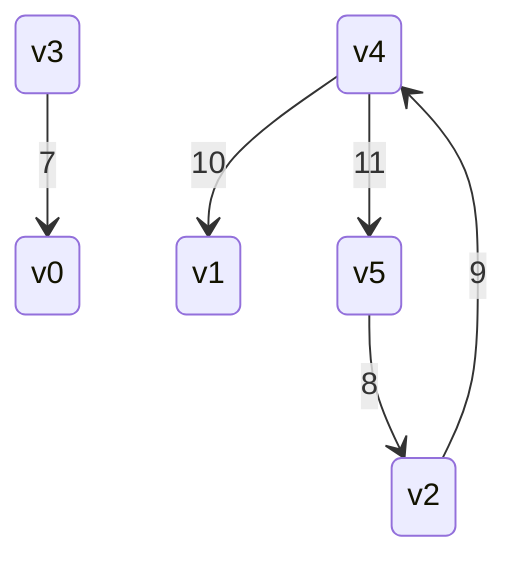
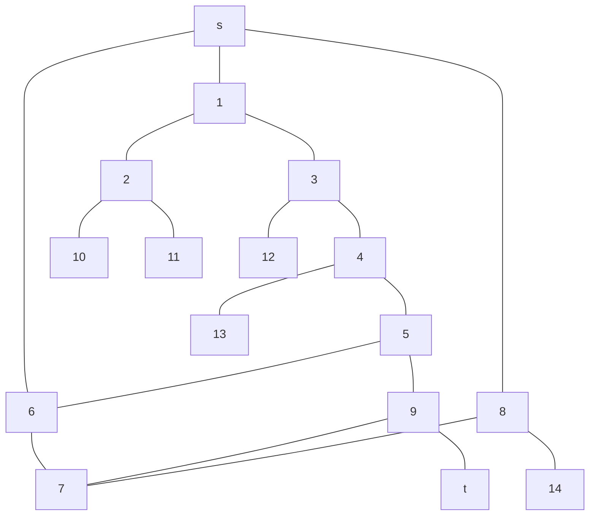

# グラフ

グラフの種類

+ 無向、重みなしグラフ: 方向関係なく節点対(u, v)の関係をモデル化する
+ 有向グラフ: 節点対(u, v)の関係が(u,v)の関係とは異なるモデル
+ 重みありグラフ: 節点対(u, v)の関係に重みを伴うモデル

## 例: 有向重み付きグラフの表現

6節点、5辺のグラフを考える



グラフの隣接リスト表現

```text
[v0]
[v1]
[v2] -> [ 9 | v4 | x ]
[v3] -> [ 7 | v0 | x ]
[v4] -> [ 10 | v1 |  ] -> [ 11 | v5 | x ]
[v5] -> [ 8 | v2 | x ]
```

グラフの隣接行列表現

| | v0 | v1 | v2 | v3 | v4 | v5 |
| :----- | :-----: | :-----: | :-----: | :-----: | :-----:  |:-----:  |
| v0 | - |  - |  - |  - |  - |  - | 
| v1 | - |  - |  - |  - |  - |  - | 
| v2 | - | - | - | - | 9 | - |
| v3 | 7 | - | - | - | - | - |
| v4 |  - | 10 | - | - | - | 11 |
| v5 |  - | - | 8 | - | - | - |

蜜グラフのばあいはほぼすべての辺が存在するので隣接行列表現の方がよい

## グラフの探索

深さ優先探索と幅優先探索がある

### 深さ優先探索(depth first search)

深さ優先探索は特定の節点から探索を始め、到達可能なすべての節点を調査する。
迷路を深さ優先で解析する際、分岐をと行き止まりノードとしたグラフとして考える。




流れとしては

+ s -> [1, 6, 8]
+ 1 -> [2, 3]
+ 2 -> [10, 11]
+ 3 -> [12, 4]
+ ...
 
と隣接する節点を再帰的に確認してtを探す


### 幅優先探索