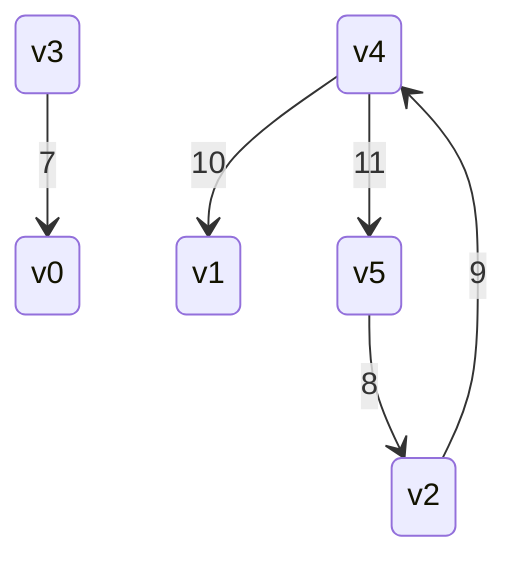
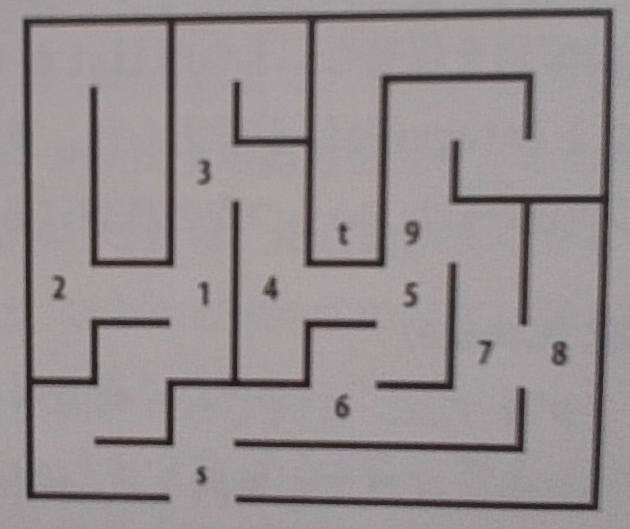
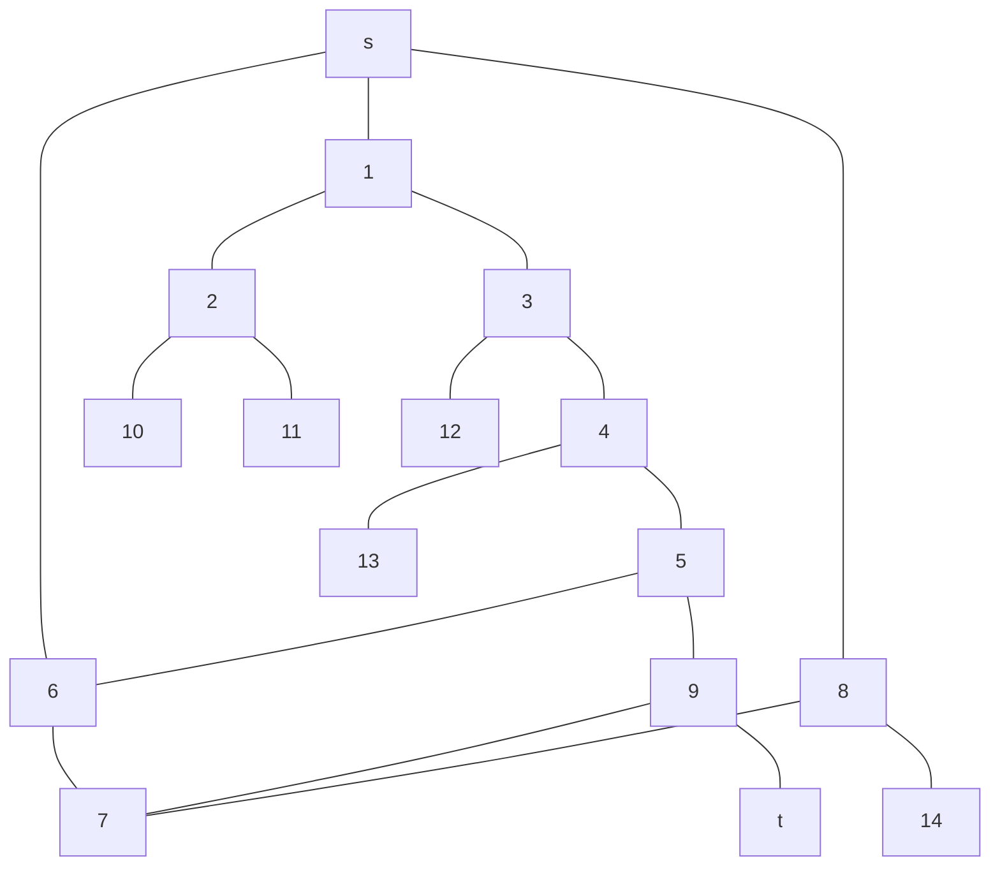
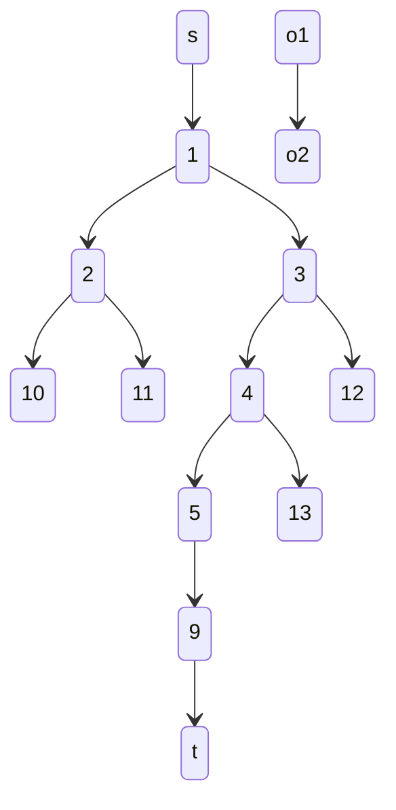
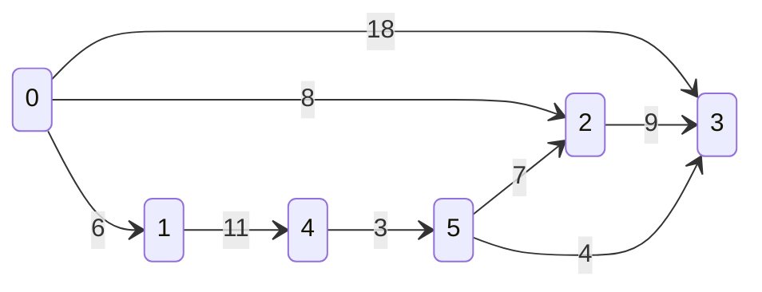
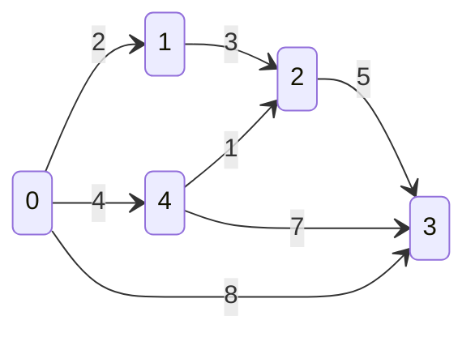

# グラフ

グラフの種類

+ 無向、重みなしグラフ: 方向関係なく節点対(u, v)の関係をモデル化する
+ 有向グラフ: 節点対(u, v)の関係が(u,v)の関係とは異なるモデル
+ 重みありグラフ: 節点対(u, v)の関係に重みを伴うモデル

## 例: 有向重み付きグラフの表現

6節点、5辺のグラフを考える



グラフの隣接リスト表現

```text
[v0]
[v1]
[v2] -> [ 9 | v4 | x ]
[v3] -> [ 7 | v0 | x ]
[v4] -> [ 10 | v1 |  ] -> [ 11 | v5 | x ]
[v5] -> [ 8 | v2 | x ]
```

グラフの隣接行列表現

| | v0 | v1 | v2 | v3 | v4 | v5 |
| :----- | :-----: | :-----: | :-----: | :-----: | :-----:  |:-----:  |
| v0 | - |  - |  - |  - |  - |  - | 
| v1 | - |  - |  - |  - |  - |  - | 
| v2 | - | - | - | - | 9 | - |
| v3 | 7 | - | - | - | - | - |
| v4 |  - | 10 | - | - | - | 11 |
| v5 |  - | - | 8 | - | - | - |

蜜グラフの場合はほぼすべての辺が存在するので隣接行列表現の方がよい

## グラフの探索

+ 深さ優先探索
+ 幅優先探索
+ 単一始点最短経路

### 深さ優先探索(depth first search)

深さ優先探索は特定の節点から探索を始め、到達可能なすべての節点を調査する。
グラフで表現した際に一番深いところまで探索するので深さ優先探索と言う。
迷路を深さ優先で解析する際、分岐をと行き止まりを節点としたグラフとして考える。





流れとしては

+ s -> [1, 6, 8]
+ 1 -> [2, 3]
+ 2 -> [10, 11]
+ 3 -> [12, 4]
+ ...
 
と隣接する節点を再帰的に確認してtを探す。なのでグラフの端のラインの最深節点に最初に到達する。


### 幅優先探索(breadth first search)

ある節点sからk辺だけ離れたすべての節点を、k+1だけ離れた節点より先に訪問する(この時のkが深さ)。
グラフで表現すると深さではなく幅を優先して調査するので幅優先探索と呼ぶ。
最短経路を求める際に利用する。

ex) 下記例ではs -> 1 -> 2 -> 3 -> 10 -> 11 -> 4 -> 12 -> 5 -> 13 -> 2 -> tの順で走査する。o1, o2は走査されない。



### 単一始点最短経路

交通の最短経路など、辺に重みをつけた場合の最短距離計算で利用する

+ ダイクストラ法
+ 密グラフ用ダイクストラ法
+ ベルマン・フォード法

#### ダイクストラ法(dijkstras algorithm)

優先度付きキューを利用して最短経路を求める方式。
Rust上の優先度付きキューはBinaryHeapを利用して実現する。というかRust公式でも、[BinaryHeap](https://doc.rust-lang.org/std/collections/binary_heap/index.html)の説明でダイクストラ法が使われている。

ex) グラフ例



優先度付きキューは下記の用に更新される

1回目: `[0, ]`<br/>
2回目: `[1, 2, 3, ]`<br/>
3回目: `[2, 4, 3, ]`<br/>
4回目: `[4, 3, ]`<br/>
5回目: `[3, 5]`<br/>
6回目: `[]`<br/>

反復回数に応じた各節点への到達は下記の用に更新

| 反復回数/節点 | 0 | 1 | 2 | 3 | 4 | 5 |
| :-----: | :----- | :----- | :----- | :----- | :----- | :----- |
| 1回目 | 0 | inf | inf | inf | inf | inf |
| 2回目 | 0 | 6| 8| 18| inf | inf |
| 3回目 | 0 | 6| 8| 18| 17 | inf |
| 4回目 | 0 | 6| 8| 17 | 17 | inf |
| 5回目 | 0 | 6| 8| 17 | 17 | 20 |
| 6回目 | 0 | 6| 8| 17 | 17 | 20 |


#### 密グラフ用ダイクストラ法(dijkstras algorithm for dense graphs)

蜜グラフ(ノードに対するエッジの数が多いグラフ)の場合は優先度付きキューを使わず、隣接行列構造を利用して探索を行う。

#### ベルマン・フォード法

蜜グラフ用ダイクストラを負の重みに対応したもの。負の数となる閉ループが存在しない限り有効(負の数の閉ループがあると、ループをぐるぐる回ってれば最短経路になってしまう)。

### 全対最短経路

単一始点からではなく、任意の節点対から最短経路を求めたい時などに利用する。動的計画法を使う。

+ フロイド-ワーシャル法

#### フロイド-ワーシャル法

各接点`u`から自分を含めた全節点への最短経路を生成する。
既知の重みから全探索で各経路の重みを算出してゆく。

### 最小被覆木アルゴリズム

グラフを覆う被覆木(全節点を繋ぐ辺の集合)の中で最小の辺の数を持つ被覆木を探索するアルゴリズム。
最小被覆木のことをMSTと呼ぶ。

+ プリム法

#### プリム法

得られた被覆木がMSTと判断できるまで貪食法で辺を追加してゆく方式。
被覆木はすべての節点を含むため、開始節点はランダム or 固定で選出される。
優先度付きキューを利用して探索を行う。

+ `G`: 無向連結グラフ。$`G = (V, E)`$
+ `V`: 節点の集合
+ `E`: 辺の集合
+ `T`: 被覆木
+ `S`: 成長集合
+ `u`, `v`: $`u \in V`$、$`v \in V`$

$$ u \in Sとv \in V - Sの間の最小の重みを持つ辺(u, v)はMSTに含まれる $$


ex) グラフ例(実際は無向グラフ)

