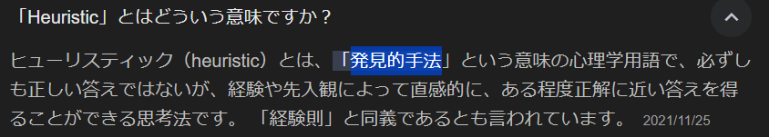

# 経路探索

経路探索を使って問題を解く

+ ゲーム木
+ 探索木

## ゲーム木

〇×ゲームなど、盤面の初期状態からプレイヤー2人がそれぞれ交代で手を打つゲームで利用する木。

ex) ゲーム木の例

2種類の節点から構成される木。AND/OR木とも言う。

+ OR節点: 最上位の節点は次の層の中からどれか一つを選ぶ。
+ AND節点: 2層目はどんな子の節点が選択されても負けない手を選択する
。

盤面の状態遷移から特定プレイヤーが勝つ or 引き分けるチャンスを最大化する。

出てくるアルゴリズム

+ ミニマックス
+ ネグマックス
+ アルファベータ法

### ミニマックス

n手先まで状態を考慮したゲーム木を構築する。各改装においてMAX層とMIN層が交互に発生する。

+ MAX層: ゲーム状態の評価点数を最大化する事を目標とする層。プレイヤーを有利にする。
+ MIN層: ゲーム状態の評価点数を最小化する事を目標とする層。相手を有利にする。

読みの深さ(ply)をどれぐらいに設定するかはゲームによる。

### ネグマックス

ミニマックスの進化版アルゴリズム。MIN層、MAX層を共通の手法で扱う。
ゲーム状態点数のつけ方が違うだけ。

### アルファベータ法

ネグマックスの進化版アルゴリズム。非生産的な探索を刈り込む。

## 探索木

8パズルなど、 プレイヤーが初期状態から特定の状態へ到達するまでの一連の手順を見つける。
8パズルは3x3マスの盤面と1～8までの数値+空白から成るパズル。

+ 深さ優先探索
+ 幅優先探索
+ A*探索

を説明する。

### 深さ優先探索

木の最深部へ一番最初に探索を行う。盤面状態の数が多くなるため、事前に深さがわかっている場合のみ有用。
また、各状態を1回しか訪問しないように記憶する必要がある(特定状態が2回以上訪問されると無限ループとなる)。
05_探索の深さ優先探索との違いは、`各状態を記憶しておく`ところ。
遷移先をスタックに保持することで再帰の機構を排除している。

### 幅優先探索

深さ優先探索のスタックをキューに置き換えることで幅優先探索となる。05_探索の幅優先探索と同じくk + 1層より先にk層を探索する。

### A*探索

`探索にヒューリスティックな知性を利用する`アルゴリズム。とのこと。

評価関数$`f(n)`$を利用して評価関数が最小となるような探索対象とする。なのでA*アルゴリズムの肝は評価関数。

+ $`f(n)`$: $`f(n) = g(n) + h(n)`$。初期状態からnを経由して目標へ淘汰する最短経路長を推定する。
+ $`g(n)`$: 初期状態からnへの最短経路と予測される手順の長さを記録する
+ $`h(n)`$: nから目標状態への最短経路を予測する

$`f(n)`$の代表的なもの

+ GoodEvaluator関数 - 1971 Nilsson
  + $`P(n) + 3 * S(n)`$。
    + $`P(n)`$: 各コマのホームからのマンハッタン距離の和。
    + $`S(n)`$: 中央でないマス目を順に調べて付けた点数
      + 次の駒が正しいなら0。そうでないなら2。中央に位置する駒があれば1。
+ WeakEvaluator関数 - 1971 Nilsson
  + 位置が誤っている駒の数。
+ FairEvaluator関数
  + $`P(n)`$: 各コマのホームからのマンハッタン距離の和。
+ BadEvaluator関数
  + 反対側のマス目との差の和が16からどれだけ離れているかで判定。空のマス目は0。

