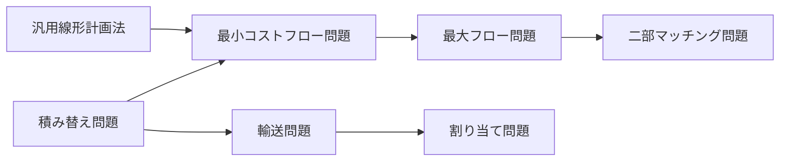
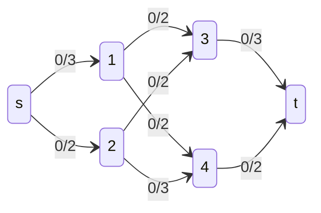

# 08_ネットワークフローアルゴリズム

節点と辺からなるネットワークについての問題を解くアルゴリズム。

ネットワークフローの定義

ネットワークを有向グラフでモデル化する

+ G: グラフ。$`G = (V, E)`$
  + すべての節点が連結されている必要はないが、浮島はない想定
+ V: 節点の集合
+ E: 辺の集合
+ s: ソース節点。商品の生産を行う特別な節点。$`s \in V`$
+ t: シンク節点。商品の消費を行う特別な節点。$`t \in V`$
+ e: 辺。
  + $`e \in E, e = (u, v)`$
    + $`u \in V, v \in V`$
  + フローfと容量cを持ち、`f/c`の表記で表される。
  + 例) $`5/10`$ -> 容量が10で、フローが5。
+ c: 辺が持つ容量。
  + $`c = c(e), c = c(u, v)`$
  + $`0 \leqq c`$
+ f: 辺が持つフロー(現在の流通量)。
  + $`f = f(e), f = f(u, v)`$。
  + $`0 \leqq f(e) \leqq c(e)`$
+ ネットワーク経路
  + 閉路ではない異なる節点列とEに含まれるn - 1個の連続した辺からなる経路
  + 辺の方向が無視できる

容量制約

+ $`f(e) \geqq 0`$
+ $`c(e) \geqq 0`$
+ $`0 \leqq f(e) \leqq c(e)`$
+ 辺$`(u, v)`$が存在しない場合、$`c(u, v) = 0`$

フロー保存

+ ソースとシンクをのぞく辺Uに対して、$`\sum f(v, u) = \sum f(u, w)`$
  + $`u,v,w \in U`$
  + $`u \in V, u \notin s, u \notin t`$
  + 測定の辺へ入るフローと出てゆくフローの総数は一致する。(消費されない)

反対称性

+ $`f(u, v) = -f(v, u)`$

解く問題

+ 割り当て問題(Assignment)
  + 一連の作業に対して作業員を割り当てる場合の全体コスト最小化
+ 二部マッチング問題(Bipartile Matching)
  + 資格が必要な作業に資格を満たす人数割り当ての最大化
+ 最大フロー問題(Maximum Flow)
  + 拠点間の流通量最大化
+ 輸送問題(Transportation)
  + 拠点間の流通コスト最小化
+ 積み替え問題(Transshipment)
  + 拠点間の積み替えコスト最小化

それぞれの問題を解くに当たって、基本となるのが線形計画法(LP)

+ 汎用線形計画法(LP)
  + シンプレックスアルゴリズムを用いた汎用解。$`Ax <= b,  x >= 0`$の時、目標関数$`\sum (c^t x)`$を最小化する。
+ 割り当て問題(Assignment)
  + 供給節点は1ユニット生産。需要節点は1ユニット消費。需要を満たすのが目標。
+ 二部マッチング問題(Bipartile Matching)
  + ソース節点がシンク節点にマッチする。辺の容量が1。対の個数を最大化するのが目標。
+ 最大フロー問題(Maximum Flow)
  + 単一のソース節点が複数ユニットを配布節点経由でシンク節点に到達するように流す。各辺には容量と実際のフローが付随する。ネットワークフロー$`\sum flow(e)`$を最大化するのが目標。
+ 輸送問題(Transportation)
  + 複数ユニットが供給節点から需要節点に流れる。すべての需要を満たした上でトータルコスト最小化するのが目標。
+ 積み替え問題(Transshipment)
  + 複数ユニットが供給節点から需要節点もしくは積み替え用の節点に流れる。需要を満たし、すべての辺でかかるコストと積み替えにかかるコストの総和を最小化する。
+ 最小コストフロー問題
  + 供給節点が複数ユニットを配布節点のネットワークに流す。需要節点で消費。各辺には容量・実フロー・1ユニット当たりのコストが不随する。需要のすべてを満たしながら全辺での総コスト$`\sum flow(e) * cost(e)`$を最小化する。

## 最大フロー

ソースからシンクへの最大フローを計算する。フォードカールソン法を利用して、増加道を見つけてゆき、増加道がなくなると停止する。

条件
+ すべての有向辺`e`に対して$`c(u, v) \geqq 0`$が与えられている
  + $`e \in E`$

+ 経路
  + `V`からのn個の節点の系列で作られる。
    + $`(p_0, p_1, ..., p_{n-1})`$
    + $`p_0`$: ソース節点
    + $`p_{n-1}`$: シンク節点
  + 前方辺と後方辺からなる
  + 前方辺: 連結した節点の辺が$`(p_i, p_{i+1}) \in E`$
  + 後方辺: 連結した節点の辺が$`(p_{i + 1}, p_i) \in E`$

例) 初期グラフ

最大フロー設定済みのグラフ

