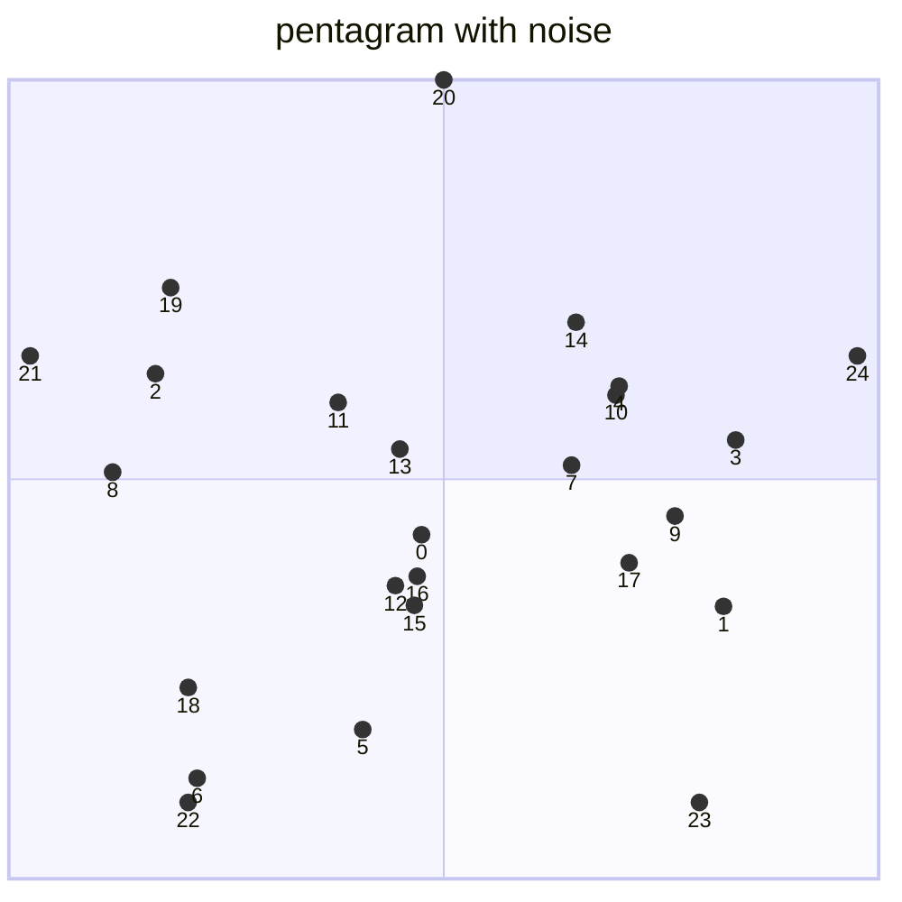
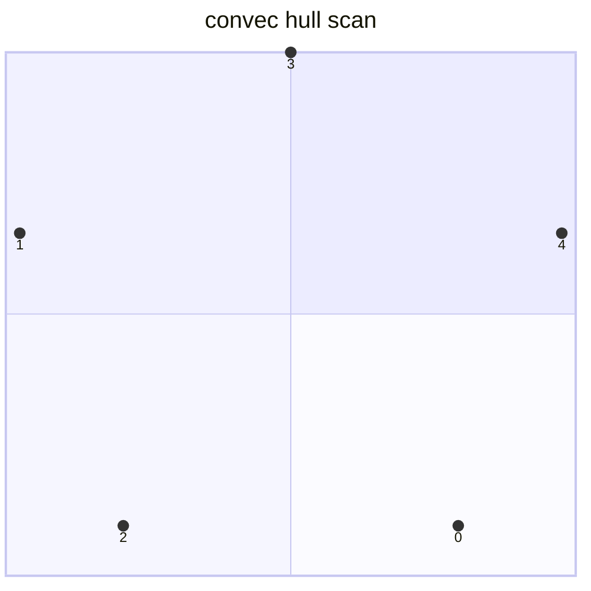
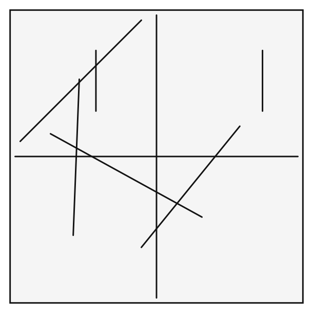
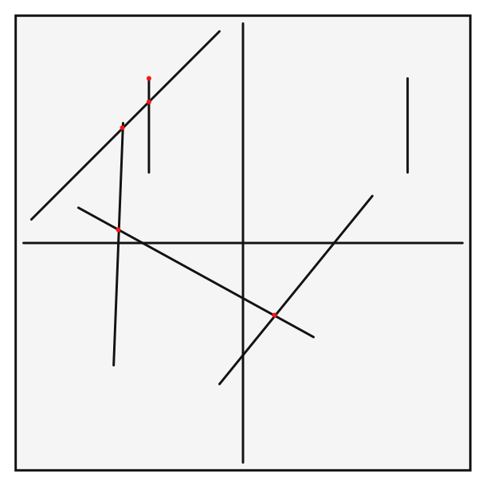
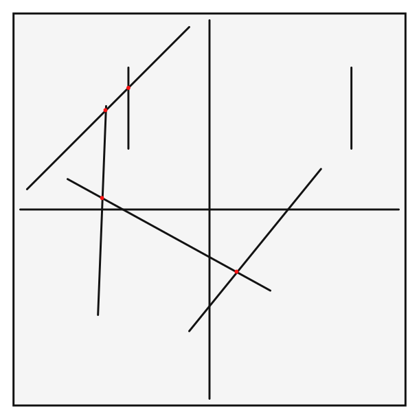
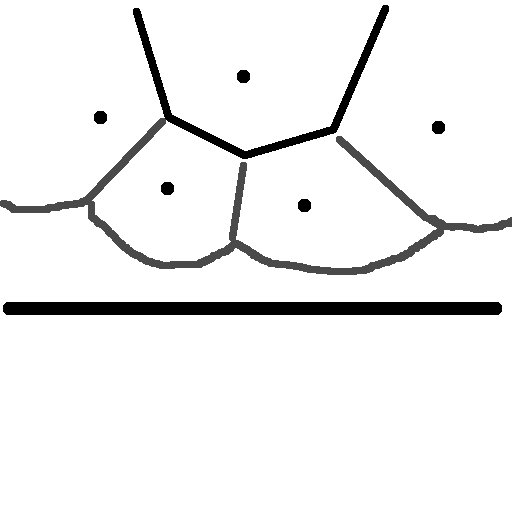
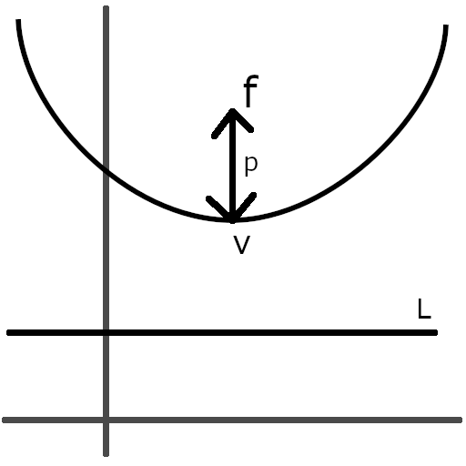
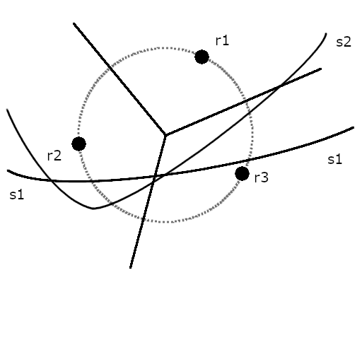
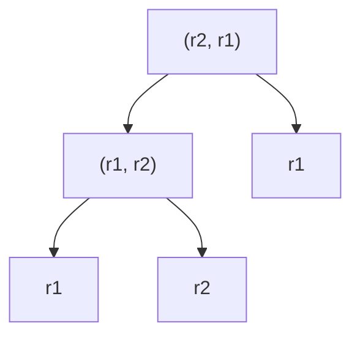

# outline

線分走査法を利用して下記問題を解く

+ 凸包
  + 2次元点集合を囲む最小の凸包を計算
+ 交差線分
  + 2次元線分の集合を元に交差を計算する
+ ボロノイ図
  + 2次元点集合に対する距離に基づく平面分割

## 凸包

2次元点集合が3要素あった場合、外積を用いて方向を確認する

```math
cp = \begin{vmatrix}
L_{i-1}.x & L_{i-1}.y & 1 \\
L_i.x & L_i.y & 1 \\
p.x & p.y & 1
\end{vmatrix}
```

```math
cp = (L_1.x - L_{i_1}.x)(p.y - L_{i-1}.y) - (L_1.y - L_{i-1}.y)(p.x - L_{i-1}.x)
```

```math
direction = \left\{
\begin{array}{ll}
共線 & (cp = 0) \\
右回り & (cp < 0) \\
左回り & (cp > 0) \\
\end{array}
\right.
```

一番左端の要素から開始し、右回りのものだけを抽出することで凸包特性を保持する。

例) 凸法適用前データ



例)凸包適用後データ



## 線分交差

2次元平面で線分の集合Sが与えられたとき、全ての線分間の交点を求める
力任せに計算すると、交点の計算回数が$`C(n, 2) = n * (n - 1) / 2`$となり、処理にかかる時間は$`O(n^2)`$。

### 交点計算のやり方

#### 直線の定義(再確認)

```math
y = mx
```

$`(a, b)`$を通る線分

```math
b = ma + k \\
k = b - ma
```

$`(a, b)`$を通る線分$`(x, y)`$の定義(傾きが同じ)

```math
y = mx + k \\
y = mx + (b - ma) \\
y - b = m(x - a)
```

#### 線分について

線分$`l`$を考える。線分$`l`$は$`(x_1, y_1)`$, $`(x_2, y_2)`$を通るとして。

```math
\left\{
  \begin{array}{}
  ax_1 + by_1 + c = 0 \\
  ax_2 + by_2 + c = 0 \\
  \end{array}
\right.
```

傾きを

```math
m = \Delta y - \Delta x \\
\Delta y = y_2 - y_1 \\

\Delta x = x_2 - x_1 \\

```

として、

```math
m = (y_2 - y_1) / (x_2 - x_1) \\

m * (x_2 - x_1) =(y_2 - y_1) \\

(\Delta y / \Delta x)(x_2 - x_1) =y_2 - y_1 \\

\Delta y (x_2 - x_1) = \Delta x(y_2 - y_1) \\

\Delta yx_2 - \Delta yx_1 = \Delta xy_2 - \Delta xy_1 \\

\Delta yx_2 - \Delta yx_1 - \Delta xy_2 + \Delta xy_1 = 0 \\

(y_2 - y_1)x_2 - (y_2 - y_1)x_1 - (x_2 - x_1)y_2 + (x_2 - x_1)y_1 = 0 \\

x_2(y_2 - y_1) - x_1(y_2 - y_1) - y_2(x_2 - x_1) + y_1(x_2 - x_1) = 0 \\

x_2(y_2 - y_1) - y_2(x_2 - x_1) - x_1(y_2 - y_1) + y_1(x_2 - x_1) = 0 \\

x_2(y_2 - y_1) + y_2(x_1 - x_2) - x_1(y_2 - y_1) + y_1(x_2 - x_1) = 0
```

$`a, b, c`$を定義

```math
a = y_2 - y_1 \\

b = x_1 - x_2
```

として

```math
x_2(y_2 - y_1) + y_2(x_1 - x_2) - x_1(y_2 - y_1) + y_1(x_2 - x_1) = 0 \\

ax_2 + by_2 - x_1(y_2 - y_1) + y_1(x_2 - x_1) = 0 \\

c = y_1(x_2 - x_1) - x_1(y_2 - y_1)
```

#### 交差点の計算

2つの線分$`L = [l_1, l_2]`$を考える。各線分の傾きなどを下記の通り定義する。

```math
l_1 = [(l_1.x_1, l_1.y_1), (l_1.x_2, l_1.y_2)] \\

l_2 = [(l_2.x_1, l_2.y_1), (l_2.x_2, l_2.y_2)] \\

L_1 = (l_1.a, l_1.b, l_1.c) \\

L_2 = (l_2.a, l_2.b, l_2.c)

```

各係数からの交点$`x, y`$算出

```math
\left\{
\begin{array}{}
l_1.ax + l_1.by + l_1.c = 0 \\
l_2.ax + l_2.by + l_2.c = 0
\end{array}
\right. \\

x = (l_1.b * l_2.c - l_2.b * l_1.c) / (l_1.a * l_2.b - l_2.a * l_1.b) \\

y = (l_2.a * l_1.c - l_1.a * l_2.c) / (l_1.a * l_2.b - l_2.a * l_1.b)
```

交差判定


```math
t1 = l_1.a * l_2.x_1 + l_1.b * l_2.y_1 + l_1.c \\

t2 = l_1.a * l_2.x_2 + l_1.b * l_2.y_2 + l_1.c \\

t3 = l_2.a * l_1.x_1 + l_2.b * l_1.y_1 + l_2.c \\

t4 = l_2.a * l_1.x_2 + l_2.b * l_1.y_2 + l_2.c \\

((t1 \geqq 0 \cap t2 \leqq 0) \cup (t1 \leqq 0 \cap t2 \geqq 0) \cap \\

(t1 \geqq 0 \cap t2 \leqq 0) \cup (t1 \leqq 0 \cap t2 \geqq 0))
```

元データ



交点の抽出



#### 線分交差法

線分交差法は、隣り合う線分に着目して線分の交差を判定する。交点の個数が線分の個数に比べて大幅に少ない場合に有用。

前提条件

+ 重複した線分は存在しない
+ どの線分も共線にはない。(同一の角度で互いに重ならない)
+ どの線分も一点に縮退しない。(長さが0の線分は存在しない)

#### 実行結果

lines 

| no | start | end |
| :---- | :---- | :---- |
| 1 | (-5.5, -5.2) | (-5.1, 5.1) |
| 2 | (-4, 3) | (-4, 7) |
| 3 | (-9, 1) | (-1, 9) |
| 4 | (3, -4) | (-7, 1.5) |
| 5 | (-1, -6) | (5.5, 2) |
| 6 | (7, 3) | (7, 7) |


cross point

| no | x | y |
| :---- | :---- | :---- |
| 1 | -5.108080808080809 | 4.891919191919191 |
| 2 | -5.276615969581749 | 0.5521387832699624 |
| 3 | -4 | 6 |
| 4 | 1.3585313174946003 | -3.09719222462203 |

モデル



総あたり


線分交差(失敗)


## ボロノイ図

n個の2次元点集合Pへの各領域の距離に基づいて平面を領域に分割する。
n個の各領域は、他の点$`p_j \in P`$よりも点$`p_i \in P`$に近い点からなる。
集合Pから3点を取り、3点すべてが円周に位置するような中心点が各領域の分岐点となる。


フォーチュン走査法を利用してボロノイ図の作成を行う。

### フォーチュン走査法

線分交差の様に走査線をりいようするが、フォーチュン走査法では走査線が平面を3つの領域に分割する。

+ 未処理の点を有する領域
+ ボロノイが確定した領域
+ ボロノイが未確定の領域

フォーチュン走査法の走査線は汀線と呼ばれる複雑な構造を持つ。



汀線状態の各点は走査線に対して放物線となる。

<details><summary>放物線の幾何学的形状</summary>

焦点f、直線Lがあるとき、放物線はfとLから等距離にある平面上の点からなる対称形。
放物線の頂点$`v = (h, k)`$は形状の最低点。pはLとvの距離であり、vとfの距離とも等しい。
$`4p(y - k) = (x - h)^2`$



</details>

ボロノイ点は他のどのPの点も内に含まない様な同一円状にあるPの3点を検出する事で計算できる。ボロノイ点から放射される線がボロノイ辺。

汀線は点の処理順で変化するので、放物線と破断点を2分木で保持する。(弧が葉、破断点が内部節点)





