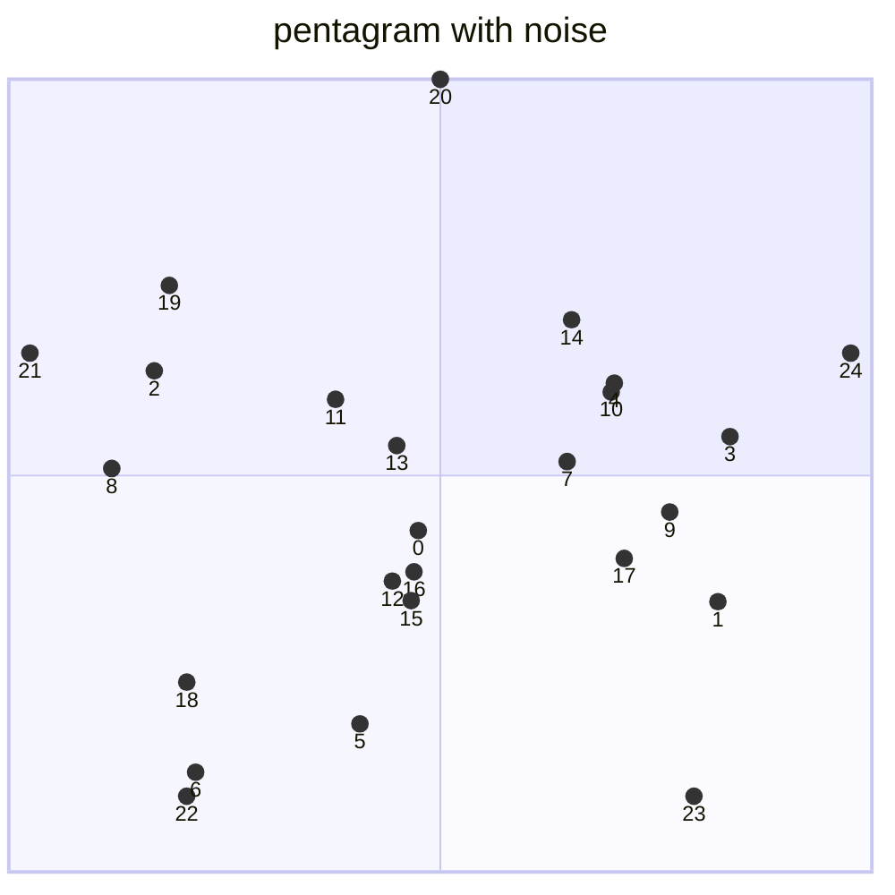
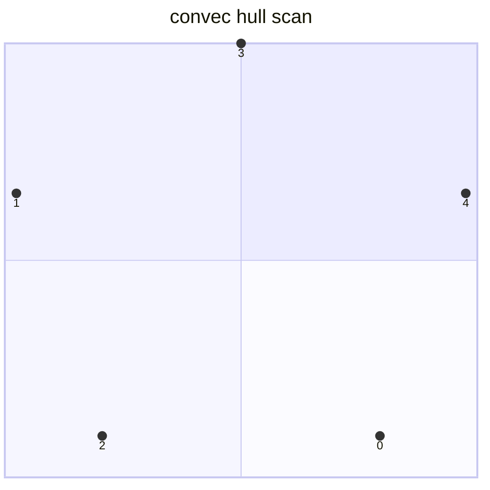

# outline

線分走査法を利用して下記問題を解く

+ 凸包
  + 2次元点集合を囲む最小の凸包を計算
+ 交差線分
  + 2次元線分の集合を元に交差を計算する
+ ボロノイ図
  + 2次元点集合に対する距離に基づく平面分割

## 凸包

2次元点集合が4要素あった場合、外積を用いて方向を確認する

```math
cp = \begin{vmatrix}
L_{i-1}.x & L_{i-1}.y & 1 \
L_i.x & L_i.y & 1 \
p.x & p.y & 1
\end{vmatrix}
```

```math
cp = (L_1.x - L_{i_1}.x)(p.y - L_{i-1}.y) - (L_1.y - L_{i-1}.y)(p.x - L_{i-1}.x)
```

```math
direction = \left\{
\begin{array}{ll}
共線 & (cp = 0) \
右回り & (cp < 0) \
左回り & (cp > 0)
\end{array}
\right.
```

一番左端の要素から開始し、右回りのものだけを抽出することで凸包特性を保持する。

例) 凸法適用前データ



例)凸包適用後データ

