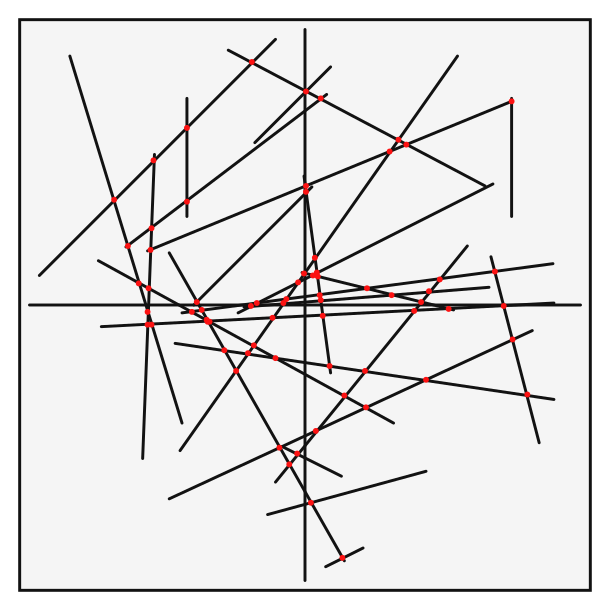
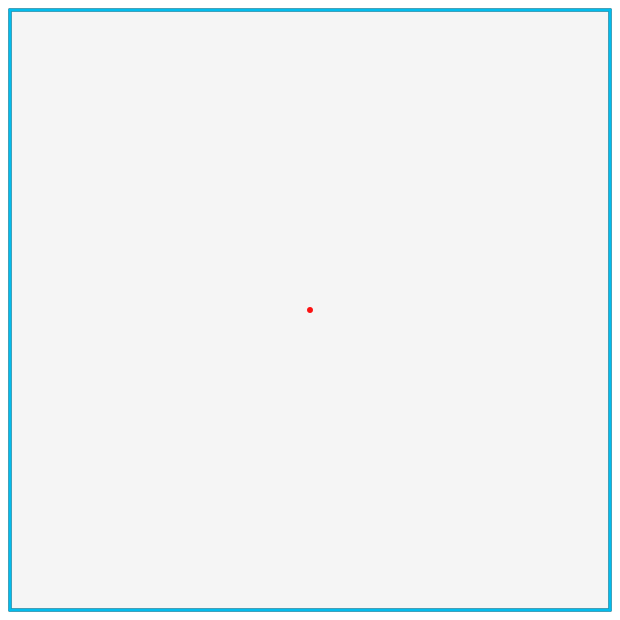
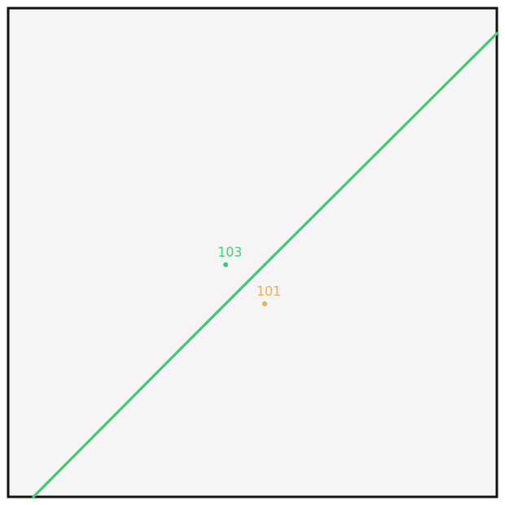
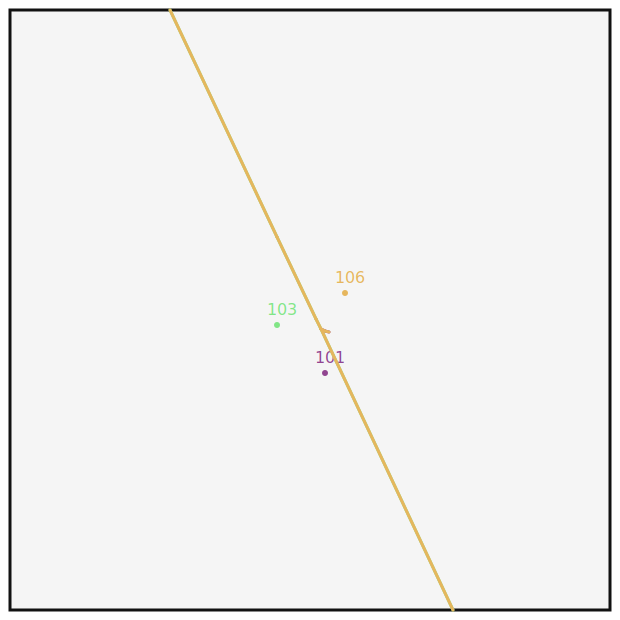
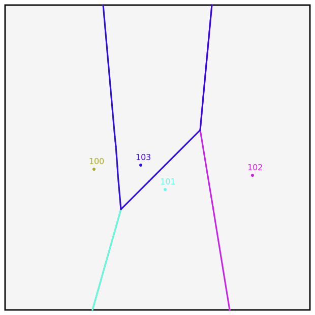
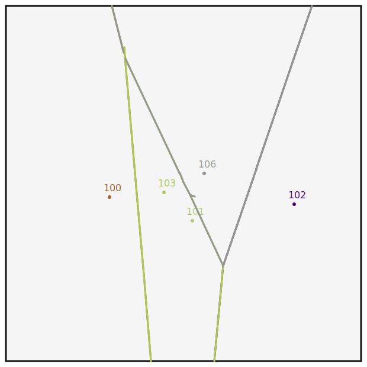
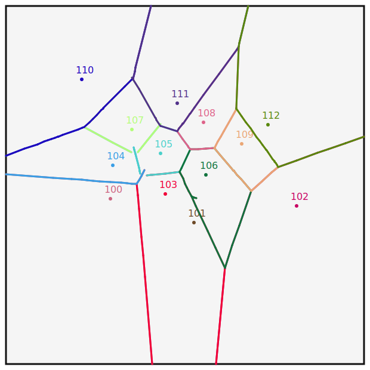

# outline

線分走査法を利用して下記問題を解く

+ 凸包
  + 2次元点集合を囲む最小の凸包を計算
+ 交差線分
  + 2次元線分の集合を元に交差を計算する
+ ボロノイ図
  + 2次元点集合に対する距離に基づく平面分割

## 凸包

2次元点集合が3要素あった場合、外積を用いて方向を確認する

```math
cp = \begin{vmatrix}
L_{i-1}.x & L_{i-1}.y & 1 \\
L_i.x & L_i.y & 1 \\
p.x & p.y & 1
\end{vmatrix}
```

```math
cp = (L_1.x - L_{i_1}.x)(p.y - L_{i-1}.y) - (L_1.y - L_{i-1}.y)(p.x - L_{i-1}.x)
```

```math
direction = \left\{
\begin{array}{ll}
共線 & (cp = 0) \\
右回り & (cp < 0) \\
左回り & (cp > 0) \\
\end{array}
\right.
```

一番左端の要素から開始し、右回りのものだけを抽出することで凸包特性を保持する。

例) 凸法適用前データ


例)凸包適用後データ


## 線分交差

2次元平面で線分の集合Sが与えられたとき、全ての線分間の交点を求める
力任せに計算すると、交点の計算回数が$`C(n, 2) = n * (n - 1) / 2`$となり、処理にかかる時間は$`O(n^2)`$。

### 交点計算のやり方

#### 直線の定義(再確認)

```math
y = mx
```

$`(a, b)`$を通る線分

```math
b = ma + k \\
k = b - ma
```

$`(a, b)`$を通る線分$`(x, y)`$の定義(傾きが同じ)

```math
y = mx + k \\
y = mx + (b - ma) \\
y - b = m(x - a)
```

#### 線分について

線分$`l`$を考える。線分$`l`$は$`(x_1, y_1)`$, $`(x_2, y_2)`$を通るとして。

```math
\left\{
  \begin{array}{}
  ax_1 + by_1 + c = 0 \\
  ax_2 + by_2 + c = 0 \\
  \end{array}
\right.
```

傾きを

```math
m = \Delta y - \Delta x \\
\Delta y = y_2 - y_1 \\

\Delta x = x_2 - x_1 \\

```

として、

```math
m = (y_2 - y_1) / (x_2 - x_1) \\

m * (x_2 - x_1) =(y_2 - y_1) \\

(\Delta y / \Delta x)(x_2 - x_1) =y_2 - y_1 \\

\Delta y (x_2 - x_1) = \Delta x(y_2 - y_1) \\

\Delta yx_2 - \Delta yx_1 = \Delta xy_2 - \Delta xy_1 \\

\Delta yx_2 - \Delta yx_1 - \Delta xy_2 + \Delta xy_1 = 0 \\

(y_2 - y_1)x_2 - (y_2 - y_1)x_1 - (x_2 - x_1)y_2 + (x_2 - x_1)y_1 = 0 \\

x_2(y_2 - y_1) - x_1(y_2 - y_1) - y_2(x_2 - x_1) + y_1(x_2 - x_1) = 0 \\

x_2(y_2 - y_1) - y_2(x_2 - x_1) - x_1(y_2 - y_1) + y_1(x_2 - x_1) = 0 \\

x_2(y_2 - y_1) + y_2(x_1 - x_2) - x_1(y_2 - y_1) + y_1(x_2 - x_1) = 0
```

$`a, b, c`$を定義

```math
a = y_2 - y_1 \\

b = x_1 - x_2
```

として

```math
x_2(y_2 - y_1) + y_2(x_1 - x_2) - x_1(y_2 - y_1) + y_1(x_2 - x_1) = 0 \\

ax_2 + by_2 - x_1(y_2 - y_1) + y_1(x_2 - x_1) = 0 \\

c = y_1(x_2 - x_1) - x_1(y_2 - y_1)
```

#### 交差点の計算

2つの線分$`L = [l_1, l_2]`$を考える。各線分の傾きなどを下記の通り定義する。

```math
l_1 = [(l_1.x_1, l_1.y_1), (l_1.x_2, l_1.y_2)] \\

l_2 = [(l_2.x_1, l_2.y_1), (l_2.x_2, l_2.y_2)] \\

L_1 = (l_1.a, l_1.b, l_1.c) \\

L_2 = (l_2.a, l_2.b, l_2.c)

```

各係数からの交点$`x, y`$算出

```math
\left\{
\begin{array}{}
l_1.ax + l_1.by + l_1.c = 0 \\
l_2.ax + l_2.by + l_2.c = 0
\end{array}
\right. \\

x = (l_1.b * l_2.c - l_2.b * l_1.c) / (l_1.a * l_2.b - l_2.a * l_1.b) \\

y = (l_2.a * l_1.c - l_1.a * l_2.c) / (l_1.a * l_2.b - l_2.a * l_1.b)
```

交差判定


```math
t1 = l_1.a * l_2.x_1 + l_1.b * l_2.y_1 + l_1.c \\

t2 = l_1.a * l_2.x_2 + l_1.b * l_2.y_2 + l_1.c \\

t3 = l_2.a * l_1.x_1 + l_2.b * l_1.y_1 + l_2.c \\

t4 = l_2.a * l_1.x_2 + l_2.b * l_1.y_2 + l_2.c \\

((t1 \geqq 0 \cap t2 \leqq 0) \cup (t1 \leqq 0 \cap t2 \geqq 0) \cap \\

(t1 \geqq 0 \cap t2 \leqq 0) \cup (t1 \leqq 0 \cap t2 \geqq 0))
```

元データ


交点の抽出


#### 線分交差法

線分交差法は、隣り合う線分に着目して線分の交差を判定する。交点の個数が線分の個数に比べて大幅に少ない場合に有用。

前提条件

+ 重複した線分は存在しない
+ どの線分も共線にはない。(同一の角度で互いに重ならない)
+ どの線分も一点に縮退しない。(長さが0の線分は存在しない)

#### 実行結果

lines 

| no | start | end |
| :---- | :---- | :---- |
| 1 | (-5.5, -5.2) | (-5.1, 5.1) |
| 2 | (-4, 3) | (-4, 7) |
| 3 | (-9, 1) | (-1, 9) |
| 4 | (3, -4) | (-7, 1.5) |
| 5 | (-1, -6) | (5.5, 2) |
| 6 | (7, 3) | (7, 7) |


cross point

| no | x | y |
| :---- | :---- | :---- |
| 1 | -5.108080808080809 | 4.891919191919191 |
| 2 | -5.276615969581749 | 0.5521387832699624 |
| 3 | -4 | 6 |
| 4 | 1.3585313174946003 | -3.09719222462203 |

モデル


総あたり


線分交差(失敗)




## ボロノイ図

n個の2次元点集合Pへの各領域の距離に基づいて平面を領域に分割する。
n個の各領域は、他の点$`p_j \in P`$よりも点$`p_i \in P`$に近い点からなる。
集合Pから3点を取り、3点すべてが円周に位置するような中心点が各領域の分岐点となる。


フォーチュン走査法を利用してボロノイ図の作成を行う。

### フォーチュン走査法

線分交差の様に走査線をりいようするが、フォーチュン走査法では走査線が平面を3つの領域に分割する。

+ 未処理の点を有する領域
+ ボロノイが確定した領域
+ ボロノイが未確定の領域

フォーチュン走査法の走査線は汀線と呼ばれる複雑な構造を持つ。


汀線状態の各点は走査線に対して放物線となる。

<details><summary>放物線の幾何学的形状</summary>

焦点f、直線Lがあるとき、放物線はfとLから等距離にある平面上の点からなる対称形。
放物線の頂点$`v = (h, k)`$は形状の最低点。pはLとvの距離であり、vとfの距離とも等しい。
$`4p(y - k) = (x - h)^2`$


</details>

ボロノイ点は他のどのPの点も内に含まない様な同一円状にあるPの3点を検出する事で計算できる。ボロノイ点から放射される線がボロノイ辺。

汀線は点の処理順で変化するので、放物線と破断点を2分木で保持する。(弧が葉、破断点が内部節点)


### 参考

+ [計算幾何学 第四章 ボロノイ図](http://i-health.u-aizu.ac.jp/CompuGeo/2017/handouts/chapter4/Chapter4H.pdf)

### 結果

#### factor: 1

1点



#### factor: 2

2点




#### factor: 3

3点



#### factor: 4

4点



#### factor: 5

5点



<details><summary>add line</summary><div>

```text
event: Site, timing: 52.61
point [106] add line (55.94, -26.47) to (27.61, -25.33)
point [106] add line (55.94, -26.47) to (84.69, -27.63)
event: Site, timing: 53.94
point [106] add line (27.61, -25.33) to (24.16, -25.19)
point [106, 103] add line (44.62, 37.92) to (34.8, 17.05)
point [103, 106] add line (44.62, 37.92) to (48.78, 46.76)
point [106] add line (84.69, -27.63) to (88.25, -27.78)
event: Circle, timing: 54.13729040689461
point [106] add line (24.16, -25.19) to (23.67, -25.18)
point [106, 100] add line (29.27, -2.79) to (23.67, -25.22)
point [100, 106] add line (29.27, -2.79) to (33.28, 13.26)
point [106, 103] add line (34.8, 17.05) to (33.77, 14.87)
point [103, 106] add line (48.78, 46.76) to (48.97, 47.16)
point [106] add line (88.25, -27.78) to (88.75, -27.8)
event: Circle, timing: 54.175162296083606
point [100] add line (23.67, -25.18) to (23.16, -25.24)
point [100, 103] add line (33.35, 11.79) to (33.58, 14.45)
point [103, 106] add line (48.97, 47.16) to (49, 47.23)
point [106] add line (88.75, -27.8) to (88.84, -27.8)
event: Site, timing: 55.94
point [100] add line (23.16, -25.24) to (11.18, -26.86)
point [100, 103] add line (33.58, 14.45) to (36.08, 43.32)
point [103, 106] add line (49, 47.23) to (50.15, 49.67)
point [106] add line (88.84, -27.8) to (93.06, -27.97)
event: Site, timing: 60.6
point [100] add line (11.18, -26.86) to (-4.62, -28.98)
point [100, 103] add line (36.08, 43.32) to (36.91, 52.88)
point [103, 106] add line (50.15, 49.67) to (51.86, 53.31)
point [106, 102] add line (81.25, 14.62) to (70.53, 45.94)
point [102, 106] add line (81.25, 14.62) to (119.2, -96.27)
point [106] add line (93.06, -27.97) to (102.76, -28.36)
event: Circle, timing: 60.636713947243194
point [100] add line (-4.62, -28.98) to (-4.72, -29)
point [100, 103] add line (36.91, 52.88) to (36.91, 52.92)
point [103, 106] add line (51.86, 53.31) to (51.87, 53.33)
point [106, 101] add line (52.61, 53.52) to (51.87, 53.33)
point [101, 106] add line (52.61, 53.52) to (53.32, 53.7)
point [106, 102] add line (70.53, 45.94) to (70.51, 46.01)
point [102, 106] add line (119.2, -96.27) to (119.44, -96.98)
point [106] add line (102.76, -28.36) to (102.83, -28.36)
event: Circle, timing: 60.6367139472432
event: Circle, timing: 99.59875002259022
point [100] add line (-4.72, -29) to (-73.2, -38.22)
point [100, 103] add line (36.91, 52.92) to (38.89, 75.75)
point [103, 106] add line (51.87, 53.33) to (61.21, 73.17)
point [106, 102] add line (70.51, 46.01) to (61.21, 73.17)
point [102, 106] add line (119.44, -96.98) to (356.48, -789.77)
point [106] add line (102.83, -28.36) to (160.32, -30.68)
event: Circle, timing: 99.59875002259027
event: last, timing: 200
point [100] add line (-73.2, -38.22) to (-201.61, -55.51)
point [100, 103] add line (38.89, 75.75) to (43.27, 126.29)
point [103, 102] add line (61.21, 73.17) to (56.42, 125.83)
point [102, 106] add line (356.48, -789.77) to (960.46, -2554.97)
point [106] add line (160.32, -30.68) to (276.32, -35.36)
```

</div></details>

#### factor: 13

13点



<details><summary>add lines</summary><div>

```text
event: Site, timing: 27.3
point [110] add line (21.31, -43.09) to (-10.2, -50.58)
point [110] add line (21.31, -43.09) to (49.65, -36.35)
event: Circle, timing: 27.32425151796871
point [110] add line (-10.2, -50.58) to (-10.26, -50.59)
point [110, 111] add line (47.95, -29.31) to (46.38, -23.03)
point [111, 110] add line (47.95, -29.31) to (49.7, -36.3)
point [110] add line (49.65, -36.35) to (49.7, -36.33)
event: Circle, timing: 27.324251517968726
event: Site, timing: 32.63
point [110] add line (-10.26, -50.59) to (-22.53, -53.51)
point [110, 111] add line (46.38, -23.03) to (36.3, 17.26)
point [111] add line (49.7, -36.33) to (74.45, -35.93)
event: Site, timing: 33.3
point [110] add line (-22.53, -53.51) to (-23.92, -53.84)
point [110, 111] add line (36.3, 17.26) to (36.01, 18.43)
point [111, 108] add line (55.27, 24.93) to (52.78, 28.35)
point [108, 111] add line (55.27, 24.93) to (59.59, 19)
point [111] add line (74.45, -35.93) to (76.13, -35.91)
event: Site, timing: 34.63
point [110] add line (-23.92, -53.84) to (-26.62, -54.48)
point [110, 111] add line (36.01, 18.43) to (35.51, 20.42)
point [111, 108] add line (52.78, 28.35) to (51.51, 30.1)
point [108, 111] add line (59.59, 19) to (64.52, 12.23)
point [111, 112] add line (73.26, -23.08) to (65.33, 10.36)
point [112, 111] add line (73.26, -23.08) to (92.4, -103.81)
point [111] add line (76.13, -35.91) to (79.25, -35.86)
event: Circle, timing: 34.63180729729103
point [110] add line (-26.62, -54.48) to (-26.63, -54.49)
point [110, 107] add line (35.29, 20.64) to (35.29, 20.65)
point [107, 110] add line (35.29, 20.64) to (35.29, 20.65)
point [110, 111] add line (35.51, 20.42) to (35.51, 20.43)
point [108, 111] add line (64.52, 12.23) to (64.52, 12.24)
point [112, 111] add line (92.4, -103.81) to (92.42, -103.89)
event: Circle, timing: 34.78861051627115
point [110] add line (-26.63, -54.49) to (-26.94, -54.56)
point [110, 107] add line (35.29, 20.65) to (33.33, 22.6)
point [107, 111] add line (35.29, 20.03) to (37.19, 23.31)
point [111, 108] add line (51.51, 30.1) to (51.4, 30.24)
point [108, 111] add line (64.52, 12.24) to (65.06, 11.49)
point [111, 112] add line (65.33, 10.36) to (65.06, 11.49)
point [112, 111] add line (92.42, -103.89) to (94.01, -110.6)
point [111] add line (79.25, -35.86) to (79.6, -35.85)
event: Circle, timing: 34.788610516271156
event: Site, timing: 38.62
point [110] add line (-26.94, -54.56) to (-34.28, -56.31)
point [110, 107] add line (33.33, 22.6) to (27.3, 28.63)
point [107, 111] add line (37.19, 23.31) to (41.81, 31.29)
point [111, 108] add line (51.4, 30.24) to (49.5, 32.85)
point [108, 112] add line (65.06, 11.5) to (64.42, 28.63)
point [112, 111] add line (94.01, -110.6) to (129.34, -259.63)
point [111] add line (79.6, -35.85) to (87.38, -35.72)
event: Circle, timing: 38.73589220418147
point [110] add line (-34.28, -56.31) to (-34.49, -56.35)
point [110, 107] add line (27.3, 28.63) to (27.2, 28.72)
point [107, 111] add line (41.81, 31.29) to (41.87, 31.4)
point [111, 108] add line (49.5, 32.85) to (49.45, 32.91)
point [108, 112] add line (64.42, 28.63) to (64.41, 28.84)
point [112, 109] add line (65.93, 30.91) to (64.41, 28.81)
point [109, 112] add line (65.93, 30.91) to (67.12, 32.55)
point [112, 111] add line (129.34, -259.63) to (130.37, -263.98)
point [111] add line (87.38, -35.72) to (87.6, -35.72)
event: Circle, timing: 39.240375949992924
point [110] add line (-34.49, -56.35) to (-35.42, -56.58)
point [110, 107] add line (27.2, 28.72) to (26.8, 29.12)
point [107, 111] add line (41.87, 31.4) to (42.13, 31.85)
point [111, 108] add line (49.45, 32.91) to (49.25, 33.19)
point [108, 109] add line (64.41, 28.84) to (62.9, 31.53)
point [109, 112] add line (67.12, 32.55) to (68.34, 34.23)
point [112, 111] add line (130.37, -263.98) to (134.82, -282.73)
point [111] add line (87.6, -35.72) to (88.53, -35.71)
event: Site, timing: 41.29
point [110] add line (-35.42, -56.58) to (-39.12, -57.46)
point [110, 107] add line (26.8, 29.12) to (25.36, 30.56)
point [107, 111] add line (42.13, 31.85) to (43.05, 33.43)
point [111, 108] add line (49.25, 33.19) to (48.46, 34.28)
point [108, 109] add line (62.9, 31.53) to (60.86, 35.15)
point [109, 112] add line (68.34, 34.23) to (70.11, 36.67)
point [112, 111] add line (134.82, -282.73) to (152.79, -358.53)
point [111] add line (88.53, -35.71) to (92.18, -35.65)
event: Circle, timing: 41.293578077071075
point [110] add line (-39.12, -57.46) to (-39.12, -57.45)
point [111, 105] add line (43.29, 33.51) to (43.29, 33.52)
point [105, 111] add line (43.29, 33.51) to (43.29, 33.52)
point [112, 111] add line (152.79, -358.53) to (152.83, -358.73)
point [111] add line (92.18, -35.65) to (92.19, -35.65)
event: Circle, timing: 42.8112801688165
point [110] add line (-39.12, -57.45) to (-41.8, -58.09)
point [110, 107] add line (25.36, 30.56) to (24.42, 31.5)
point [107, 105] add line (43.29, 33.15) to (39.6, 37.58)
point [105, 111] add line (43.29, 33.52) to (47.9, 35.05)
point [111, 108] add line (48.46, 34.28) to (47.9, 35.05)
point [108, 109] add line (60.86, 35.15) to (60.05, 36.59)
point [109, 112] add line (70.11, 36.67) to (70.9, 37.76)
point [112, 111] add line (152.83, -358.73) to (166.03, -414.38)
point [111] add line (92.19, -35.65) to (94.77, -35.61)
event: Site, timing: 44.62
point [110] add line (-41.8, -58.09) to (-44.92, -58.83)
point [110, 107] add line (24.42, 31.5) to (23.39, 32.53)
point [107, 105] add line (39.6, 37.58) to (38.27, 39.18)
point [105, 108] add line (47.9, 35.05) to (49.46, 37.21)
point [108, 109] add line (60.05, 36.59) to (59.29, 37.95)
point [109, 112] add line (70.9, 37.76) to (71.69, 38.85)
point [112, 111] add line (166.03, -414.38) to (181.71, -480.54)
point [111] add line (94.77, -35.61) to (97.72, -35.56)
event: Site, timing: 47.28
point [110] add line (-44.92, -58.83) to (-49.41, -59.9)
point [110, 107] add line (23.39, 32.53) to (21.97, 33.95)
point [107, 104] add line (29.97, 38.2) to (21.98, 33.95)
point [104, 107] add line (29.97, 38.2) to (35.12, 40.95)
point [107, 105] add line (38.27, 39.18) to (36.87, 40.85)
point [105, 108] add line (49.46, 37.21) to (50.99, 39.32)
point [108, 109] add line (59.29, 37.95) to (58.34, 39.63)
point [109, 112] add line (71.69, 38.85) to (72.73, 40.27)
point [112, 111] add line (181.71, -480.54) to (204.68, -577.43)
point [111] add line (97.72, -35.56) to (101.88, -35.49)
event: Circle, timing: 47.28168882459341
point [107, 104] add line (21.98, 33.95) to (21.97, 33.94)
point [105, 108] add line (50.99, 39.32) to (50.99, 39.33)
point [108, 106] add line (55.94, 39.93) to (55.94, 39.94)
point [106, 108] add line (55.94, 39.93) to (55.94, 39.94)
point [109, 112] add line (72.73, 40.27) to (72.73, 40.28)
point [112, 111] add line (204.68, -577.43) to (204.7, -577.53)
event: Circle, timing: 47.625540439643835
point [110] add line (-49.41, -59.9) to (-49.98, -60.04)
point [110, 104] add line (21.97, 33.95) to (21.48, 34.13)
point [104, 105] add line (35.78, 39.57) to (35.93, 40.18)
point [105, 108] add line (50.99, 39.33) to (51.16, 39.56)
point [108, 106] add line (55.94, 39.94) to (53.67, 40.04)
point [106, 108] add line (55.94, 39.94) to (58.23, 39.83)
point [108, 109] add line (58.34, 39.63) to (58.23, 39.83)
point [109, 112] add line (72.73, 40.28) to (72.85, 40.45)
point [112, 111] add line (204.7, -577.53) to (207.66, -590)
point [111] add line (101.88, -35.49) to (102.4, -35.48)
event: Circle, timing: 47.62554043964394
event: Circle, timing: 48.50680853893854
point [110] add line (-49.98, -60.04) to (-51.44, -60.39)
point [110, 104] add line (21.48, 34.13) to (20.3, 34.55)
point [104, 105] add line (35.93, 40.18) to (36.25, 41.46)
point [105, 108] add line (51.16, 39.56) to (51.57, 40.13)
point [108, 106] add line (53.67, 40.04) to (51.57, 40.13)
point [106, 109] add line (58.23, 39.83) to (59.84, 41.68)
point [109, 112] add line (72.85, 40.45) to (73.18, 40.9)
point [112, 111] add line (207.66, -590) to (215.25, -622)
point [111] add line (102.4, -35.48) to (103.73, -35.46)
event: Site, timing: 52.61
point [110] add line (-51.44, -60.39) to (-58.09, -61.97)
point [110, 104] add line (20.3, 34.55) to (15.86, 36.16)
point [104, 105] add line (36.25, 41.46) to (37.22, 45.32)
point [105, 106] add line (51.57, 40.14) to (49.04, 45.48)
point [106, 109] add line (59.84, 41.68) to (62.97, 45.3)
point [109, 112] add line (73.18, 40.9) to (74.63, 42.9)
point [112, 111] add line (215.25, -622) to (250.55, -770.92)
point [111] add line (103.73, -35.46) to (109.69, -35.36)
event: Circle, timing: 53.78296474954639
point [110] add line (-58.09, -61.97) to (-59.95, -62.41)
point [110, 104] add line (15.86, 36.16) to (14.75, 36.56)
point [104, 105] add line (37.22, 45.32) to (37.43, 46.16)
point [105, 103] add line (44.62, 46.87) to (40.9, 47.3)
point [103, 105] add line (44.62, 46.87) to (48.61, 46.4)
point [105, 106] add line (49.04, 45.48) to (48.61, 46.4)
point [106, 109] add line (62.97, 45.3) to (63.59, 46.02)
point [109, 112] add line (74.63, 42.9) to (75.04, 43.46)
point [112, 111] add line (250.55, -770.92) to (260.63, -813.45)
point [111] add line (109.69, -35.36) to (111.34, -35.34)
event: Circle, timing: 53.7829647495464
event: Site, timing: 53.94
point [110] add line (-59.95, -62.41) to (-60.2, -62.47)
point [110, 104] add line (14.75, 36.56) to (14.6, 36.61)
point [104, 105] add line (37.43, 46.16) to (37.45, 46.26)
point [105, 103] add line (40.9, 47.3) to (40.64, 47.33)
point [103, 106] add line (48.61, 46.4) to (48.78, 46.76)
point [106, 109] add line (63.59, 46.02) to (63.67, 46.11)
point [109, 112] add line (75.04, 43.46) to (75.09, 43.53)
point [112, 111] add line (260.63, -813.45) to (261.98, -819.15)
point [111] add line (111.34, -35.34) to (111.56, -35.33)
event: Circle, timing: 54.8081414377217
point [110] add line (-60.2, -62.47) to (-61.57, -62.8)
point [110, 104] add line (14.6, 36.61) to (13.81, 36.9)
point [104, 100] add line (29.27, 49.25) to (26.22, 49.02)
point [100, 104] add line (29.27, 49.25) to (32.18, 49.47)
point [104, 105] add line (37.45, 46.26) to (37.6, 46.85)
point [105, 103] add line (40.64, 47.33) to (39.38, 47.48)
point [103, 106] add line (48.78, 46.76) to (49.5, 48.28)
point [106, 109] add line (63.67, 46.11) to (64.1, 46.61)
point [109, 112] add line (75.09, 43.53) to (75.39, 43.94)
point [112, 111] add line (261.98, -819.15) to (269.43, -850.56)
point [111] add line (111.56, -35.33) to (112.77, -35.32)
event: Site, timing: 55.94
point [110] add line (-61.57, -62.8) to (-63.34, -63.21)
point [110, 104] add line (13.81, 36.9) to (12.8, 37.26)
point [104, 100] add line (26.22, 49.02) to (24.34, 48.87)
point [100, 104] add line (32.18, 49.47) to (33.89, 49.6)
point [104, 103] add line (38.76, 45.92) to (37.9, 47.5)
point [103, 106] add line (49.5, 48.28) to (50.15, 49.67)
point [106, 109] add line (64.1, 46.61) to (64.64, 47.23)
point [109, 112] add line (75.39, 43.94) to (75.77, 44.48)
point [112, 111] add line (269.43, -850.56) to (279.15, -891.57)
point [111] add line (112.77, -35.32) to (114.32, -35.29)
event: Circle, timing: 57.06646230473258
point [110] add line (-63.34, -63.21) to (-65.1, -63.64)
point [110, 104] add line (12.8, 37.26) to (11.82, 37.61)
point [104, 100] add line (24.34, 48.87) to (22.77, 48.76)
point [100, 104] add line (33.89, 49.6) to (35.29, 49.7)
point [104, 103] add line (37.9, 47.5) to (37.23, 48.72)
point [103, 106] add line (50.15, 49.67) to (50.65, 50.74)
point [106, 109] add line (64.64, 47.23) to (65.16, 47.82)
point [109, 112] add line (75.77, 44.48) to (76.16, 45)
point [112, 102] add line (81.25, 43.21) to (76.16, 45)
point [102, 112] add line (81.25, 43.21) to (87.13, 41.13)
point [112, 111] add line (279.15, -891.57) to (288.82, -932.37)
point [111] add line (114.32, -35.29) to (115.85, -35.27)
event: Circle, timing: 58.261056996229954
point [110] add line (-65.1, -63.64) to (-66.95, -64.08)
point [110, 104] add line (11.82, 37.61) to (10.81, 37.98)
point [104, 100] add line (22.77, 48.76) to (21.24, 48.64)
point [100, 104] add line (35.29, 49.7) to (36.64, 49.8)
point [104, 103] add line (37.23, 48.72) to (36.64, 49.8)
point [103, 106] add line (50.65, 50.74) to (51.11, 51.7)
point [106, 109] add line (65.16, 47.82) to (65.69, 48.43)
point [109, 102] add line (76.16, 45) to (74.28, 46.66)
point [102, 112] add line (87.13, 41.13) to (90.14, 40.07)
point [112, 111] add line (288.82, -932.37) to (299.07, -975.61)
point [111] add line (115.85, -35.27) to (117.45, -35.24)
event: Site, timing: 60.6
point [110] add line (-66.95, -64.08) to (-70.53, -64.92)
point [110, 104] add line (10.81, 37.98) to (8.87, 38.68)
point [104, 100] add line (21.24, 48.64) to (18.42, 48.43)
point [100, 103] add line (36.64, 49.8) to (36.91, 52.88)
point [103, 106] add line (51.11, 51.7) to (51.86, 53.31)
point [106, 109] add line (65.69, 48.43) to (66.69, 49.59)
point [109, 102] add line (74.28, 46.66) to (71.86, 48.81)
point [102, 112] add line (90.14, 40.07) to (94.85, 38.41)
point [112, 111] add line (299.07, -975.61) to (319.13, -1060.23)
point [111] add line (117.45, -35.24) to (120.55, -35.19)
event: Circle, timing: 60.636713947243194
point [110] add line (-70.53, -64.92) to (-70.59, -64.94)
point [110, 104] add line (8.87, 38.68) to (8.84, 38.69)
point [104, 100] add line (18.42, 48.43) to (18.38, 48.43)
point [100, 103] add line (36.91, 52.88) to (36.91, 52.92)
point [103, 106] add line (51.86, 53.31) to (51.87, 53.33)
point [106, 101] add line (52.61, 53.52) to (51.87, 53.33)
point [101, 106] add line (52.61, 53.52) to (53.32, 53.7)
point [106, 109] add line (66.69, 49.59) to (66.71, 49.61)
point [109, 102] add line (71.86, 48.81) to (71.82, 48.84)
point [102, 112] add line (94.85, 38.41) to (94.92, 38.38)
point [112, 111] add line (319.13, -1060.23) to (319.44, -1061.52)
point [111] add line (120.55, -35.19) to (120.6, -35.19)
event: Circle, timing: 60.6367139472432
event: Circle, timing: 65.11243390976094
point [110] add line (-70.59, -64.94) to (-77.34, -66.54)
point [110, 104] add line (8.84, 38.69) to (5.27, 39.98)
point [104, 100] add line (18.38, 48.43) to (13.25, 48.04)
point [100, 103] add line (36.91, 52.92) to (37.24, 56.68)
point [103, 106] add line (51.87, 53.33) to (53.11, 55.97)
point [106, 109] add line (66.71, 49.61) to (68.55, 51.73)
point [109, 102] add line (71.82, 48.84) to (68.55, 51.73)
point [102, 112] add line (94.92, 38.38) to (102.6, 35.67)
point [112, 111] add line (319.44, -1061.52) to (357.81, -1223.39)
point [111] add line (120.6, -35.19) to (126.36, -35.1)
event: Circle, timing: 78.45904077365502
point [110] add line (-77.34, -66.54) to (-96.85, -71.19)
point [110, 104] add line (5.27, 39.98) to (-4.83, 43.64)
point [104, 100] add line (13.25, 48.04) to (-1.45, 46.95)
point [100, 103] add line (37.24, 56.68) to (37.93, 64.66)
point [103, 106] add line (53.11, 55.97) to (56.36, 62.86)
point [106, 102] add line (68.55, 51.73) to (65.21, 61.49)
point [102, 112] add line (102.6, 35.67) to (123.01, 28.47)
point [112, 111] add line (357.81, -1223.39) to (472.13, -1705.64)
point [111] add line (126.36, -35.1) to (142.68, -34.83)
event: Circle, timing: 88.00618708634414
point [110] add line (-96.85, -71.19) to (-110.38, -74.4)
point [110, 104] add line (-4.83, 43.64) to (-11.84, 46.16)
point [104, 100] add line (-1.45, 46.95) to (-11.84, 46.16)
point [100, 103] add line (37.93, 64.66) to (38.37, 69.75)
point [103, 106] add line (56.36, 62.86) to (58.57, 67.55)
point [106, 102] add line (65.21, 61.49) to (63.33, 66.97)
point [102, 112] add line (123.01, 28.47) to (136.98, 23.54)
point [112, 111] add line (472.13, -1705.64) to (553.86, -2050.4)
point [111] add line (142.68, -34.83) to (153.81, -34.65)
event: Circle, timing: 99.59875002259022
point [110] add line (-110.38, -74.4) to (-126.5, -78.23)
point [110, 100] add line (-11.84, 46.16) to (-21.55, 48.48)
point [100, 103] add line (38.37, 69.75) to (38.89, 75.75)
point [103, 106] add line (58.57, 67.55) to (61.21, 73.17)
point [106, 102] add line (63.33, 66.97) to (61.21, 73.17)
point [102, 112] add line (136.98, 23.54) to (153.71, 17.63)
point [112, 111] add line (553.86, -2050.4) to (653.07, -2468.89)
point [111] add line (153.81, -34.65) to (166.92, -34.44)
event: Circle, timing: 169.5983482878737
point [110] add line (-126.5, -78.23) to (-220.1, -100.5)
point [110, 100] add line (-21.55, 48.48) to (-78.03, 61.99)
point [100, 103] add line (38.89, 75.75) to (41.95, 111.07)
point [103, 102] add line (61.21, 73.17) to (57.83, 110.35)
point [102, 112] add line (153.71, 17.63) to (253.34, -17.51)
point [112, 111] add line (653.07, -2468.89) to (1251.96, -4995.21)
point [111] add line (166.92, -34.44) to (241.54, -33.24)
event: last, timing: 200
point [110] add line (-220.1, -100.5) to (-259.77, -109.92)
point [110, 100] add line (-78.03, 61.99) to (-102.23, 67.77)
point [100, 103] add line (41.95, 111.07) to (43.27, 126.29)
point [103, 102] add line (57.83, 110.35) to (56.42, 125.83)
point [102, 112] add line (253.34, -17.51) to (296.42, -32.72)
point [112, 111] add line (1251.96, -4995.21) to (1512.03, -6092.28)
point [111] add line (241.54, -33.24) to (272.81, -32.74)
```

</div></details>