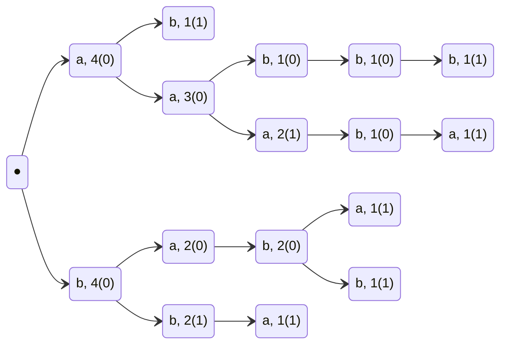

## 作成されるtrie node

---- tests::test_main_logic02 stdout ----

```mermaid
stateDiagram-v2
  direction LR;
  state "●" as v_0
  state "a, 4(0)" as v_1
  state "b, 1(1)" as v_2
  state "b, 4(0)" as v_3
  state "b, 2(1)" as v_4
  state "a, 3(0)" as v_5
  state "a, 2(1)" as v_6
  state "a, 1(1)" as v_7
  state "a, 2(0)" as v_8
  state "b, 2(0)" as v_9
  state "a, 1(1)" as v_10
  state "b, 1(1)" as v_11
  state "b, 1(0)" as v_12
  state "a, 1(1)" as v_13
  state "b, 1(0)" as v_14
  state "b, 1(0)" as v_15
  state "b, 1(1)" as v_16
  v_0 --> v_1
  v_0 --> v_3
  v_1 --> v_2
  v_1 --> v_5
  v_3 --> v_8
  v_3 --> v_4
  v_4 --> v_7
  v_5 --> v_14
  v_5 --> v_6
  v_6 --> v_12
  v_8 --> v_9
  v_9 --> v_10
  v_9 --> v_11
  v_12 --> v_13
  v_14 --> v_15
  v_15 --> v_16
```