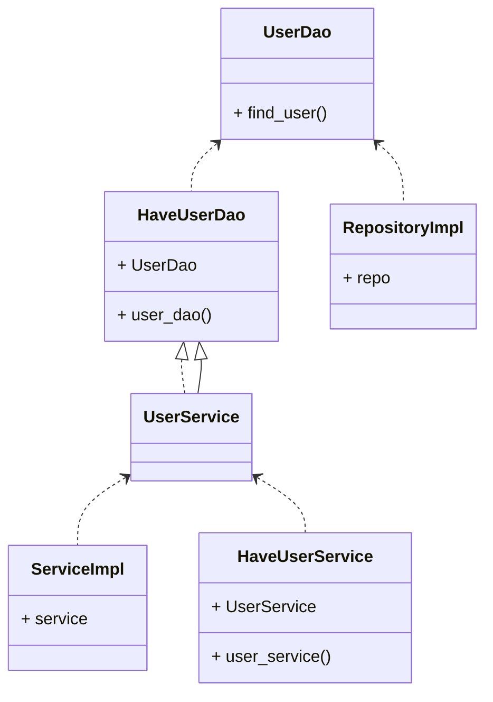
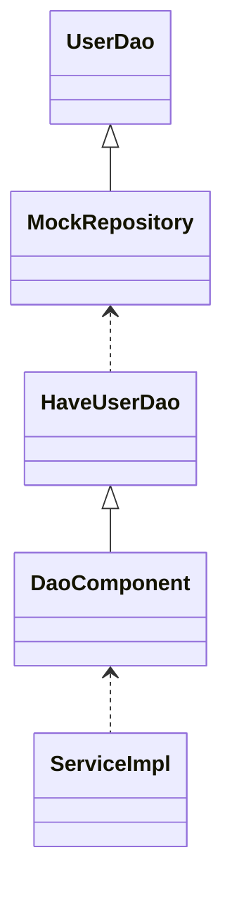

# outline

Cake Patternの学習

+ paild tech blog
  + [Rust の DI を考える –– Part 2: Rust における DI の手法の整理](https://techblog.paild.co.jp/entry/2023/06/12/170637)
+ eed3si9n
  + [実戦での Scala: Cake パターンを用いた Dependency Injection (DI)](https://eed3si9n.com/ja/real-world-scala-dependency-injection-di/)
+ Qiita
  + [Minimal Cake Pattern 再考](https://qiita.com/tayama0324/items/03ba48d3277079f20500)
  + [Rust のテストのために DI は必要か？](https://qiita.com/yan7010/items/1112722fee9fd8000377)
  + [Rustで継承を使いたい人への処方箋](https://qiita.com/muumu/items/a0d111d129d20240d182)
+ κeenのHappy Hacκing Blog
  + [RustのDI](https://keens.github.io/blog/2017/12/01/rustnodi/)
+ blog.ojisan.io
  + [Cake PatternでDIしてみた](https://blog.ojisan.io/cake-pattern/)
  + [Rust で DI](https://blog.ojisan.io   /rust-di/)

## 構成

```text
.
├── Cargo.toml
└── src
    ├── domain
    │ ├── data
    | | └── database.rs 
    │ ├── di
    | | └── app_module.rs 
    │ ├── entity
    | | └── user.rs 
    │ ├── repository
    | | └── user_repository.rs 
    │ ├── service
    | | └── user_service.rs 
    │ ├── data.rs
    │ ├── di.rs
    │ ├── entity.rs
    │ ├── repository.rs
    │ └── service.rs
    └── main.rs
```

## Minimal Cake Pattern

ニコニコアカウントで生み出されたインジェクション手法。依存性の宣言と注入の記述の簡潔さがいいらしい。

+ XXX -> トレイト境界(謎)
+ XXXに依存する -> UsesXXX
+ 依存の提供 -> ProvideXXX


| Scala | Rust |
| :----- | :----- |
| トレイト | トレイト |
| 自分型アノテーション | トレイトの継承 |
| class in class | モジュール |
| 抽象メンバー | getterメソッド |

## 2 layer



test mocking



## error

### 001

```text
error[E0599]: no method named `find` found for reference `&<T as ProvidesDatabase>::T` in the current scope
  --> src\domain\repository\user_repository.rs:14:18
   |
14 |         database.find(id)
   |                  ^^^^ method not found in `&<T as ProvidesDatabase>::T`
   |
   = help: items from traits can only be used if the trait is in scope
help: trait `UsesDatabase` which provides `find` is implemented but not in scope; perhaps you want to import it
   |
1  + use crate::domain::data::database::UsesDatabase;
   |
```


```text
error[E0599]: the method `update` exists for reference `&<T as ProvidesDatabase>::T`, but its trait bounds were not satisfied
  --> src\domain\repository\user_repository.rs:18:25
   |
18 |         self.database().update(user)
   |                         ^^^^^^ method cannot be called on `&<T as ProvidesDatabase>::T` due to unsatisfied trait bounds
   |
note: the following trait bounds were not satisfied:
      `&<T as ProvidesDatabase>::T: UserRepository`
      `<T as ProvidesDatabase>::T: UserRepository`
  --> src\domain\repository\user_repository.rs:11:9
   |
11 | impl<T: UserRepository> UsesUserRepository for T {
   |         ^^^^^^^^^^^^^^  ------------------     -
   |         |
   |         unsatisfied trait bound introduced here
   = help: items from traits can only be used if the trait is in scope
help: trait `UsesDatabase` which provides `update` is implemented but not in scope; perhaps you want to import it
   |
1  + use crate::domain::data::database::UsesDatabase;
   |
```

```text
error[E0599]: the method `find_user` exists for reference `&<T as ProvidesUserRepository>::T`, but its trait bounds were not satisfied       
  --> src\domain\service\user_service.rs:13:32
   |
13 |         self.user_repository().find_user(id)
   |                                ^^^^^^^^^ method cannot be called on `&<T as ProvidesUserRepository>::T` due to unsatisfied trait bounds 
   |
note: the following trait bounds were not satisfied:
      `&<T as ProvidesUserRepository>::T: UserService`
      `<T as ProvidesUserRepository>::T: UserService`
  --> src\domain\service\user_service.rs:11:9
   |
11 | impl<T: UserService> UsesUserService for T {
   |         ^^^^^^^^^^^  ---------------     -
   |         |
   |         unsatisfied trait bound introduced here
   = help: items from traits can only be used if the trait is in scope
help: trait `UsesUserRepository` which provides `find_user` is implemented but not in scope; perhaps you want to import it
   |
1  + use crate::domain::repository::user_repository::UsesUserRepository;
   |
```

```text
error[E0599]: the method `find_user` exists for reference `&<T as ProvidesUserRepository>::T`, but its trait bounds were not satisfied       
  --> src\domain\service\user_service.rs:17:43
   |
17 |         let user = self.user_repository().find_user(id)?;
   |                                           ^^^^^^^^^ method cannot be called on `&<T as ProvidesUserRepository>::T` due to unsatisfied trait bounds
   |
note: the following trait bounds were not satisfied:
      `&<T as ProvidesUserRepository>::T: UserService`
      `<T as ProvidesUserRepository>::T: UserService`
  --> src\domain\service\user_service.rs:11:9
   |
11 | impl<T: UserService> UsesUserService for T {
   |         ^^^^^^^^^^^  ---------------     -
   |         |
   |         unsatisfied trait bound introduced here
   = help: items from traits can only be used if the trait is in scope
help: trait `UsesUserRepository` which provides `find_user` is implemented but not in scope; perhaps you want to import it
   |
1  + use crate::domain::repository::user_repository::UsesUserRepository;
   |
```

```text
error[E0599]: no method named `update` found for reference `&<T as ProvidesUserRepository>::T` in the current scope
  --> src\domain\service\user_service.rs:20:36
   |
20 |             self.user_repository().update(user)?;
   |                                    ^^^^^^ method not found in `&<T as ProvidesUserRepository>::T`
   |
   = help: items from traits can only be used if the trait is in scope
help: trait `UsesUserRepository` which provides `update` is implemented but not in scope; perhaps you want to import it
   |
1  + use crate::domain::repository::user_repository::UsesUserRepository;
   |
```

```text
error[E0599]: no method named `user_service` found for struct `AppModule` in the current scope
  --> src/main.rs:8:20
   |
8  |     let user = app.user_service().find_user(100);
   |                    ^^^^^^^^^^^^ method not found in `AppModule`
   |
  ::: src\domain\di\app_module.rs:5:1
   |
5  | pub struct AppModule;
   | -------------------- method `user_service` not found for this struct
   |
  ::: src\domain\service\user_service.rs:28:8
   |
28 |     fn user_service(&self) -> &Self::T;
   |        ------------ the method is available for `AppModule` here
   |
   = help: items from traits can only be used if the trait is in scope
help: trait `ProvidesUserService` which provides `user_service` is implemented but not in scope; perhaps you want to import it
   |
1  + use crate::domain::service::user_service::ProvidesUserService;
   |
```

### 002 - Uses解放

```text
warning: unused import: `UsesDatabase`
 --> src\domain\di\app_module.rs:1:37
  |
1 | use crate::domain::data::{Database, UsesDatabase, ProvidesDatabase};
  |                                     ^^^^^^^^^^^^
  |
  = note: `#[warn(unused_imports)]` on by default
```

```text
warning: unused import: `UsesUserRepository`
 --> src\domain\di\app_module.rs:2:33
  |
2 | use crate::domain::repository::{UsesUserRepository, ProvidesUserRepository, UserRepository};
  |                                 ^^^^^^^^^^^^^^^^^^
```

```text
warning: unused import: `UsesUserService`
 --> src\domain\di\app_module.rs:3:30
  |
3 | use crate::domain::service::{UsesUserService, ProvidesUserService, UserService};
  |                              ^^^^^^^^^^^^^^^
```

```text
error[E0599]: no method named `user_service` found for struct `AppModule` in the current scope
  --> src/main.rs:8:20
   |
8  |     let user = app.user_service().find_user(100);
   |                    ^^^^^^^^^^^^ method not found in `AppModule`
   |
  ::: src\domain\di\app_module.rs:5:1
   |
5  | pub struct AppModule;
   | -------------------- method `user_service` not found for this struct
   |
  ::: src\domain\service\user_service.rs:28:8
   |
28 |     fn user_service(&self) -> &Self::T;
   |        ------------ the method is available for `AppModule` here
   |
   = help: items from traits can only be used if the trait is in scope
help: trait `ProvidesUserService` which provides `user_service` is implemented but not in scope; perhaps you want to import it
   |
1  + use crate::domain::service::user_service::ProvidesUserService;
   |
```

対応

+ impl ProvidesUserService for AppModuleをmainへ移動
+ UserにSerialize, Deserializeをderive
+ mainのfind_user呼び出しをStringへ変更