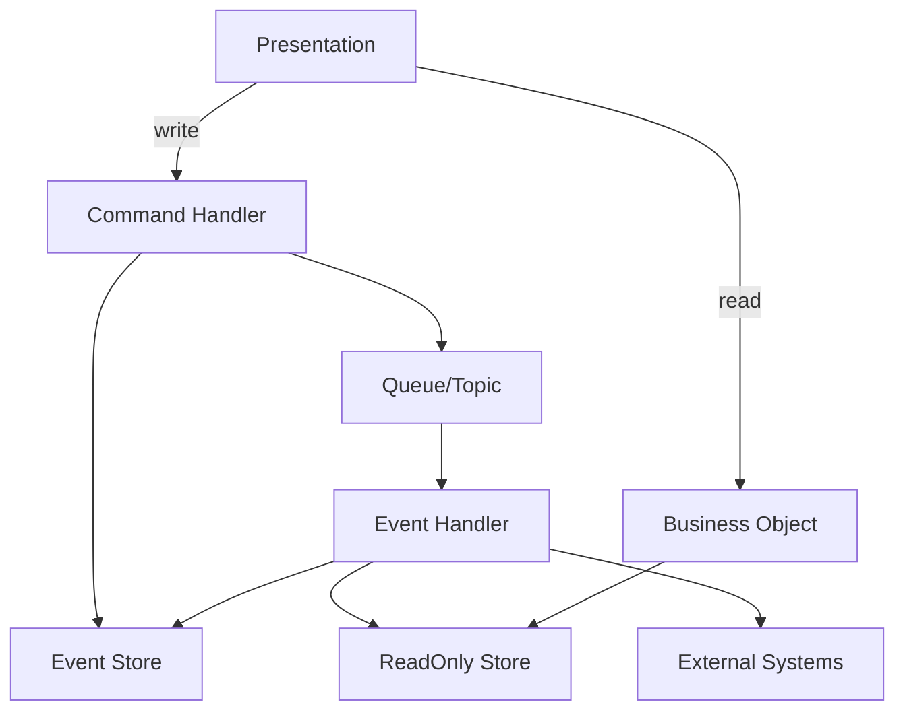
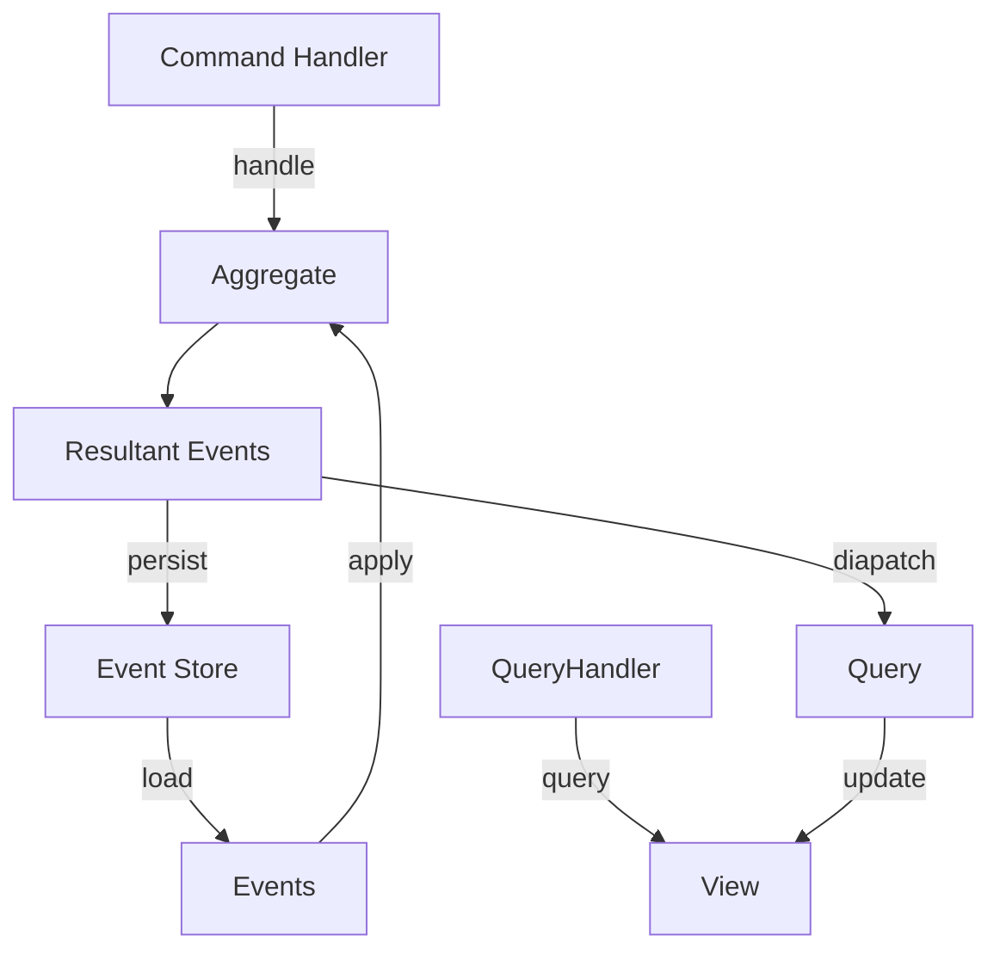

# outline

CQRS, Event Sourcingの学習

下記例では最新状態をAggregateが保持する

# project

[serverlesstechnology/cqrs](https://github.com/serverlesstechnology/cqrs)のdemoを参考に組み込み方法を学習するプロジェクト。

# reference

+ [2年間の実運用を経て振り返るイベントソーシングの実際](https://speakerdeck.com/tomohisa/2nian-jian-noshi-yun-yong-wojing-tezhen-rifan-ruibentososingunoshi-ji)
+ [Event Sourcing 完全に理解した](https://zenn.dev/shmi593/articles/56c890962bb807)
+ [CQRSとEventSourcingの基本](https://qiita.com/tuananhhedspibk/items/2ccca018f6d61e086e1c)
+ [イベント ソーシング パターン](https://learn.microsoft.com/ja-jp/azure/architecture/patterns/event-sourcing)
+ [Rust で Event Sourcing を試してみた ~ AWS のブログを参考に模倣する ~](https://zenn.dev/pyama2000/articles/a0f612677b658b)
+ [Amazon DynamoDB を使った CQRS イベントストアの構築](https://aws.amazon.com/jp/blogs/news/build-a-cqrs-event-store-with-amazon-dynamodb/)
+ [feat: AWS のブログを参考にイベントソーシングを実現する](https://github.com/pyama2000/example-cqrs-event-store/pull/7)
+ [cqrs-esからみるRustのCQRS & Event Sourceの実装](https://blog.ymgyt.io/entry/cqrs-rs-reading/)
+ [serverlesstechnology/cqrs](https://github.com/serverlesstechnology/cqrs)
  + [crate.io](https://crates.io/crates/cqrs-es)
  + [docs](https://docs.rs/cqrs-es/latest/cqrs_es/)
+ [Domain Driven Design](https://martinfowler.com/tags/domain%20driven%20design.html)