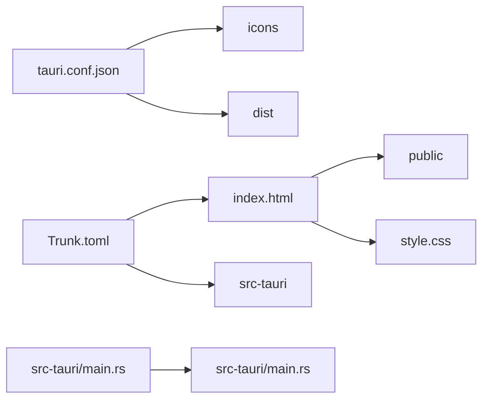

# Tauri + Leptos

This template should help get you started developing with Tauri and Leptos.

[create project](https://v2.tauri.app/ja/start/create-project/)

```shell
cargo install create-tauri-app --locked
cargo create-tauri-app
```

run

```shell
cargo tauri dev
```

## Recommended IDE Setup

+ [VS Code](https://code.visualstudio.com/) 
+ [Tauri](https://marketplace.visualstudio.com/items?itemName=tauri-apps.tauri-vscode) 
+ [rust-analyzer](https://marketplace.visualstudio.com/items?itemName=rust-lang.rust-analyzer).

# rust + leptosの構成把握

ディレクトリ構成とか参照とか




# will

+ [ ] 何かしらを入力するプログラム
+ [ ] 何かしらを記録するプログラム
+ [ ] 何かしらをグラフ表示するプログラム

# design

## splash


## top


# reference

+ [Tauri](https://v2.tauri.app/ja/)
  + [Splash Screen](https://v2.tauri.app/ja/learn/splashscreen/)
+ [Tauriを使ってデスクトップアプリケーションを作ってみた](https://tech.emotion-tech.co.jp/entry/2023/11/01/153605)
+ [【JavaScript】ここがしんどかったよTauri開発【Rust】](https://qiita.com/kurokky/items/79017c7a867a6e8122f8)
+ [Rust/Tauriに入門したので画像変換デスクトップアプリを開発してみた](https://zenn.dev/harumikun/articles/67f992728099ed)
