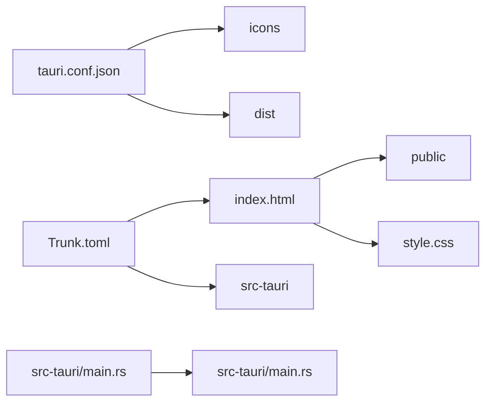

# Tauri + Leptos

This template should help get you started developing with Tauri and Leptos.

[create project](https://v2.tauri.app/ja/start/create-project/)

```shell
cargo install create-tauri-app --locked
cargo create-tauri-app
```

run

```shell
cargo tauri dev
```

## Recommended IDE Setup

+ [VS Code](https://code.visualstudio.com/) 
+ [Tauri](https://marketplace.visualstudio.com/items?itemName=tauri-apps.tauri-vscode) 
+ [rust-analyzer](https://marketplace.visualstudio.com/items?itemName=rust-lang.rust-analyzer).

# rust + leptosの構成把握

+ tauri: src-tauri
  + メインロジック定義
  + メッセージの定義
+ leptos: src
  + UIの構築

ディレクトリ構成とか参照とか



+ src: leptosによるUIの構築
+ src-tauri: イベントメッセージングの本処理
  + src
    + lib.rs
    + main.rs


# will

+ [ ] 何かしらを入力するプログラム
+ [ ] 何かしらを記録するプログラム
+ [ ] 何かしらをグラフ表示するプログラム

# design

## splash


## top


# leptos examples

+ [examples](https://github.com/leptos-rs/leptos/tree/main/examples)

## todo_app_sqlite_axum

構成を学ぶ

### ディレクトリ構成

+ root
  + public
    + favicon.ico
  + src
    + error_temoplate.rs
    + errors.rs
    + lib.rs
    + main.rs
    + todo.rs
  + style.css
  + Todo.db

### Cargo.toml

`package.metadata.leptos`なる謎セクションがある

| item | value | description |
| :----- | :----- | :------ |
| output-name | "todo_app_sqlite_axum" | The name used by wasm-bindgen/cargo-leptos for the JS/WASM bundle. Defaults to the crate name |
| site-root | "target/site" | The site root folder is where cargo-leptos generate all output. WARNING: all content of this folder will be erased on a rebuild. Use it in your server setup. |
| site-pkg-dir | "pkg" | The site-root relative folder where all compiled output (JS, WASM and CSS) is written Defaults to pkg |
| style-file | "./style.css" | [Optional] The source CSS file. If it ends with .sass or .scss then it will be compiled by dart-sass into CSS. The CSS is optimized by Lightning CSS before being written to <site-root>/<site-pkg>/app.css |
| assets-dir | "public" | [Optional] Files in the asset-dir will be copied to the site-root directory |
| site-addr | "127.0.0.1:3000" | The IP and port (ex: 127.0.0.1:3000) where the server serves the content. Use it in your server setup. |
| reload-port | 3001 | The port to use for automatic reload monitoring |
| end2end-cmd | "cargo make test-ui" | [Optional] Command to use when running end2end tests. It will run in the end2end dir. |
| end2end-dir | "e2e" | none |
| browserquery | "defaults" | The browserlist query used for optimizing the CSS. |
| watch | false | Set by cargo-leptos watch when building with that tool. Controls whether autoreload JS will be included in the head |
| env | "DEV" | none |
| bin-features | ["ssr"] | Optional. Can be over-ridden with the command line parameter --bin-features |
| bin-default-features | false | If the --no-default-features flag should be used when compiling the bin target Optional. Defaults to false. |
| lib-features | ["hydrate"] | The features to use when compiling the lib target Optional. Can be over-ridden with the command line parameter --lib-features |
| lib-default-features | false | If the --no-default-features flag should be used when compiling the lib target Optional. Defaults to false. |

# reference

+ [Tauri](https://v2.tauri.app/ja/)
  + [Splash Screen](https://v2.tauri.app/ja/learn/splashscreen/)
+ [Tauriを使ってデスクトップアプリケーションを作ってみた](https://tech.emotion-tech.co.jp/entry/2023/11/01/153605)
+ [【JavaScript】ここがしんどかったよTauri開発【Rust】](https://qiita.com/kurokky/items/79017c7a867a6e8122f8)
+ [Rust/Tauriに入門したので画像変換デスクトップアプリを開発してみた](https://zenn.dev/harumikun/articles/67f992728099ed)
+ [TauriとLeptosで作るデスクトップアプリ（3）バックエンドを呼び出す ](https://zenn.dev/daizutabi/articles/tauri-leptos-03)
+ [leptos-router](https://crates.io/crates/leptos_router)
+ leptos example
  + [todo_app_sqlite_axum](https://github.com/leptos-rs/leptos/tree/main/examples/todo_app_sqlite_axum)