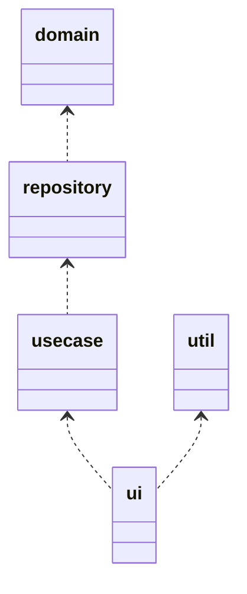

# outline

コマンドラインアプリのテンプレート

## Layer

| name | description |
| :----- | :----- |
| ui | ユーザーへのインタラクション等を提供 |
| usecase | 各種ビジネスロジック |
| repository | usecaseへdomainを提供 |
| domain | アトム的なデータアクセッサ |
| util | データ定義やログなど |

utilモジュール

| name | description |
| :----- | :----- |
| log | ログ等の共通ロジック |
| data | User等のアトムデータ定義 |



## need

+ 3層構造
+ ログ出力
+ Webアクセス(非同期)
+ ファイル管理
+ 制御ファイル(yaml)
+ 起動パラメタでのdry-run

## reference

+ [RustのClapクレートがメチャクチャ良かった話](https://zenn.dev/shinobuy/articles/53aed032fe5977)
+ [Clap の Derive API で列挙型のコマンドラインオプションを実装する](https://zenn.dev/takanori_is/articles/rust-clap-derive-api-arg-enum)
+ [Rust の新しい HTTP サーバーのクレート Axum をフルに活用してサーバーサイドアプリケーション開発をしてみる](https://blog-dry.com/entry/2021/12/26/002649#Dependency-Injection)
+ [[Rust] mockallで単体テスト](https://qiita.com/deepgreenAN/items/1b9887db759bbb96c9b6)
+ [RustのテストのTIPS](https://qiita.com/aoyagikouhei/items/dadafc8d6295db76ef0e#asyncawait%E3%81%AE%E3%83%86%E3%82%B9%E3%83%88)
+ [Rust Crate Warning About Workspace Resolver - What is it, how to fix it?](https://forum.dfinity.org/t/rust-crate-warning-about-workspace-resolver-what-is-it-how-to-fix-it/23883)
+ [Rust の Future について](https://blog.tiqwab.com/2022/03/26/rust-future.html)
+ [[Rust] フィーチャーフラグの使い方](https://qiita.com/osanshouo/items/43271813b5d62e89d598)
+ [Rustのマクロ展開後のコードを確認する](https://scrapbox.io/emanon001/Rust%E3%81%AE%E3%83%9E%E3%82%AF%E3%83%AD%E5%B1%95%E9%96%8B%E5%BE%8C%E3%81%AE%E3%82%B3%E3%83%BC%E3%83%89%E3%82%92%E7%A2%BA%E8%AA%8D%E3%81%99%E3%82%8B)

## will

+ [x]DI構成をModules形式に変更
+ [x]Domainsのインジェクション
+ [x]Repositories内の全部参照に切り替えたい
+ [x]UseCases内の全部参照に切り替えたい
+ [x]Domainsの実装
+ [x]async -> Futureとしたが、Futureを内部に閉じ込めてIFはシンプルにAppResultとする
+ [x]各層のimplはtraitを参照させる。直接implを参照させない。
  + traitを参照させようとしたら実態が見れないと怒られたので実装参照で実施
+ [ ]テスト組み込み
+ [ ]setting機能追加
+ [ ]Qiitaに記事を出す
  + base
    + struct only injection using async
  + test
    + divide trait
    + async to future -> closure future
    + write 1st test -> error mock is trait
  + for test 
    + trait injection

## problem

### warning: virtual workspace defaulting to `resolver = "1"` despite one or more workspace members being on edition 2021 which implies `resolver = "2"

```texgt
warning: virtual workspace defaulting to `resolver = "1"` despite one or more workspace members being on edition 2021 which implies `resolver = "2"`
note: to keep the current resolver, specify `workspace.resolver = "1"` in the workspace root's manifest
note: to use the edition 2021 resolver, specify `workspace.resolver = "2"` in the workspace root's manifest
note: for more details see https://doc.rust-lang.org/cargo/reference/resolver.html#resolver-versions
```

ルートのcargo.tomlにresolverを指定

```toml
[workspace]
resolver = "2"
```

### warning: use of `async fn` in public traits is discouraged as auto trait bounds cannot be specified

```text
warning: use of `async fn` in public traits is discouraged as auto trait bounds cannot be specified
 --> domain\src\domains\todo_api_client.rs:6:5
  |
6 |     async fn list(&self) -> AppResult<Vec<Todo>>;
  |     ^^^^^
  |
  = note: you can suppress this lint if you plan to use the trait only in your own code, or do not care about auto traits like `Send` on the `Future`
  = note: `#[warn(async_fn_in_trait)]` on by default
help: you can alternatively desugar to a normal `fn` that returns `impl Future` and add any desired bounds such as `Send`, but these cannot be relaxed without a breaking API change
  |
6 -     async fn list(&self) -> AppResult<Vec<Todo>>;
6 +     fn list(&self) -> impl std::future::Future<Output = AppResult<Vec<Todo>>> + Send;
  |

```

トレイトに`async fun`を定義するのは良くない。`Future <Output = > + Sync`で定義する。Domain内部は`async move {}`でFutureを作って返す。

### the trait bound `Pin<Box<(dyn std::future::Future<Output = Result<util::Todo, Box<(dyn std::error::Error + 'static)>>> + Send + 'static)>>: From<Result<util::Todo, _>>` is not satisfied

```text
error[E0277]: the trait bound `Pin<Box<(dyn std::future::Future<Output = Result<util::Todo, Box<(dyn std::error::Error + 'static)>>> + Send + 'static)>>: From<Result<util::Todo, _>>` is not satisfied
  --> usecase\src\usecases_impls\add_todo_usecase_impl.rs:45:27
   |
45 |             .return_const(Ok(expect.clone()));
   |              ------------ ^^^^^^^^^^^^^^^^^^ the trait `From<Result<util::Todo, _>>` is not implemented for `Pin<Box<(dyn std::future::Future<Output = Result<util::Todo, Box<(dyn std::error::Error + 'static)>>> + Send + 'static)>>`, which is required by `Result<util::Todo, _>: Into<Pin<Box<(dyn std::future::Future<Output = Result<util::Todo, Box<(dyn std::error::Error + 'static)>>> + Send + 'static)>>>`
   |              |
   |              required by a bound introduced by this call
   |
```

Futureを引きまわすのではなく、一番下のレイヤーでFutureを待つ。`futures::executor`を利用。

### mismatched types

```text
error[E0308]: mismatched types
  --> usecase\src\usecases_impls\add_todo_usecase_impl.rs:46:47
   |
46 |         let usecase = AddTodoUseCaseImpl::new(mock_todo_repository);
   |                       ----------------------- ^^^^^^^^^^^^^^^^^^^^ expected `TodoRepositoryImpl`, found `MockTodoRepository`      
   |                       |
   |                       arguments to this function are incorrect
   |
```

mockall用にinjectionをtraitへ変更する