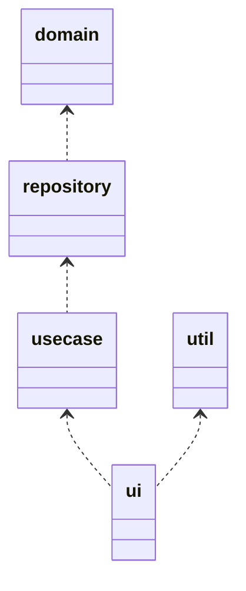

# outline

コマンドラインアプリのテンプレート

## Layer

| name | description |
| :----- | :----- |
| ui | ユーザーへのインタラクション等を提供 |
| usecase | 各種ビジネスロジック |
| repository | usecaseへdomainを提供 |
| domain | アトム的なデータアクセッサ |
| util | データ定義やログなど |

utilモジュール

| name | description |
| :----- | :----- |
| log | ログ等の共通ロジック |
| data | User等のアトムデータ定義 |

## need

+ 3層構造
+ ログ出力
+ Webアクセス(非同期)
+ ファイル管理
+ 制御ファイル(yaml)
+ 起動パラメタでのdry-run

## ui layer

+ [RustのClapクレートがメチャクチャ良かった話](https://zenn.dev/shinobuy/articles/53aed032fe5977)
+ [Clap の Derive API で列挙型のコマンドラインオプションを実装する](https://zenn.dev/takanori_is/articles/rust-clap-derive-api-arg-enum)