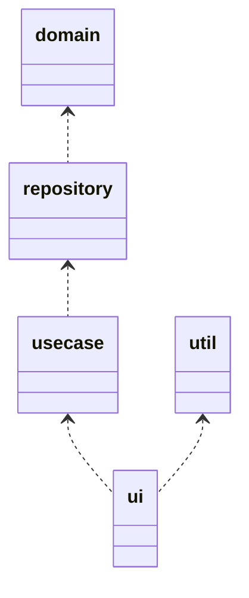

# outline

コマンドラインアプリのテンプレート

## Layer

| name | description |
| :----- | :----- |
| ui | ユーザーへのインタラクション等を提供 |
| usecase | 各種ビジネスロジック |
| repository | usecaseへdomainを提供 |
| domain | アトム的なデータアクセッサ |
| util | データ定義やログなど |

utilモジュール

| name | description |
| :----- | :----- |
| log | ログ等の共通ロジック |
| data | User等のアトムデータ定義 |



## need

+ 3層構造
+ ログ出力
+ Webアクセス(非同期)
+ ファイル管理
+ 制御ファイル(yaml)
+ 起動パラメタでのdry-run

## ui layer

+ [RustのClapクレートがメチャクチャ良かった話](https://zenn.dev/shinobuy/articles/53aed032fe5977)
+ [Clap の Derive API で列挙型のコマンドラインオプションを実装する](https://zenn.dev/takanori_is/articles/rust-clap-derive-api-arg-enum)

## trouble shoot

### 001

```text
PS C:\work\001_rust\learn_rust\projects\project_template> cargo build
warning: virtual workspace defaulting to `resolver = "1"` despite one or more workspace members being on edition 2021 which implies `resolver = "2"`
note: to keep the current resolver, specify `workspace.resolver = "1"` in the workspace root's manifest
note: to use the edition 2021 resolver, specify `workspace.resolver = "2"` in the workspace root's manifest
note: for more details see https://doc.rust-lang.org/cargo/reference/resolver.html#resolver-versions
   Compiling usecase v0.1.0 (C:\work\001_rust\learn_rust\projects\project_template\usecase)
error[E0726]: implicit elided lifetime not allowed here
  --> usecase\src\usecases_impls\get_todo_list_usecase_impl.rs:19:29
   |
19 | impl GetTodoListUseCase for GetTodoListUseCaseImpl {
   |                             ^^^^^^^^^^^^^^^^^^^^^^ expected lifetime parameter
   |
help: indicate the anonymous lifetime
   |
19 | impl GetTodoListUseCase for GetTodoListUseCaseImpl<'_> {
   |                                                   ++++

error[E0106]: missing lifetime specifier
  --> usecase\src\lib.rs:26:28
   |
26 |     get_todo_list_usecase: GetTodoListUseCaseImpl,
   |                            ^^^^^^^^^^^^^^^^^^^^^^ expected named lifetime parameter
   |
help: consider using the `'r` lifetime
   |
26 |     get_todo_list_usecase: GetTodoListUseCaseImpl<'r>,
   |                                                  ++++

error[E0726]: implicit elided lifetime not allowed here
  --> usecase\src\lib.rs:40:19
   |
40 | impl UseCases for UseCasesImpls {
   |                   ^^^^^^^^^^^^^ expected lifetime parameter
   |
help: indicate the anonymous lifetime
   |
40 | impl UseCases for UseCasesImpls<'_> {
   |                                ++++

error[E0106]: missing lifetime specifier
  --> usecase\src\lib.rs:43:31
   |
43 |     type GetTodoListUseCase = GetTodoListUseCaseImpl;
   |                               ^^^^^^^^^^^^^^^^^^^^^^ expected named lifetime parameter
   |
help: consider introducing a named lifetime parameter
   |
43 |     type GetTodoListUseCase<'a> = GetTodoListUseCaseImpl<'a>;
   |                            ++++                         ++++

error[E0107]: missing generics for struct `UseCasesImpls`
  --> usecase\src\lib.rs:40:19
   |
40 | impl UseCases for UseCasesImpls {
   |                   ^^^^^^^^^^^^^ expected 1 generic argument
   |
note: struct defined here, with 1 generic parameter: `R`
  --> usecase\src\lib.rs:22:12
   |
22 | pub struct UseCasesImpls<'r, R: Repositories> {
   |            ^^^^^^^^^^^^^     -
help: add missing generic argument
   |
40 | impl UseCases for UseCasesImpls<R> {
   |                                +++

error[E0107]: struct takes 0 lifetime arguments but 1 lifetime argument was supplied
 --> usecase\src\usecases_impls\get_todo_list_usecase_impl.rs:8:22
  |
8 |     todo_repository: TodoRepositoryImpl<'r, R>,
  |                      ^^^^^^^^^^^^^^^^^^ -- help: remove this lifetime argument
  |                      |
  |                      expected 0 lifetime arguments
  |
note: struct defined here, with 0 lifetime parameters
 --> C:\work\001_rust\learn_rust\projects\project_template\repository\src\repositories_impls\todo_repository_impl.rs:6:12
  |
6 | pub struct TodoRepositoryImpl {}
  |            ^^^^^^^^^^^^^^^^^^

error[E0107]: struct takes 0 generic arguments but 1 generic argument was supplied
 --> usecase\src\usecases_impls\get_todo_list_usecase_impl.rs:8:22
  |
8 |     todo_repository: TodoRepositoryImpl<'r, R>,
  |                      ^^^^^^^^^^^^^^^^^^     - help: remove this generic argument
  |                      |
  |                      expected 0 generic arguments
  |
note: struct defined here, with 0 generic parameters
 --> C:\work\001_rust\learn_rust\projects\project_template\repository\src\repositories_impls\todo_repository_impl.rs:6:12
  |
6 | pub struct TodoRepositoryImpl {}
  |            ^^^^^^^^^^^^^^^^^^

error[E0107]: struct takes 0 lifetime arguments but 1 lifetime argument was supplied
  --> usecase\src\lib.rs:23:19
   |
23 |     repositories: RepositoriesImpl<'r, R>,
   |                   ^^^^^^^^^^^^^^^^ -- help: remove this lifetime argument
   |                   |
   |                   expected 0 lifetime arguments
   |
note: struct defined here, with 0 lifetime parameters
  --> C:\work\001_rust\learn_rust\projects\project_template\repository\src\lib.rs:13:12
   |
13 | pub struct RepositoriesImpl {
   |            ^^^^^^^^^^^^^^^^

error[E0107]: struct takes 0 generic arguments but 1 generic argument was supplied
  --> usecase\src\lib.rs:23:19
   |
23 |     repositories: RepositoriesImpl<'r, R>,
   |                   ^^^^^^^^^^^^^^^^     - help: remove this generic argument
   |                   |
   |                   expected 0 generic arguments
   |
note: struct defined here, with 0 generic parameters
  --> C:\work\001_rust\learn_rust\projects\project_template\repository\src\lib.rs:13:12
   |
13 | pub struct RepositoriesImpl {
   |            ^^^^^^^^^^^^^^^^

error[E0107]: missing generics for struct `GetTodoListUseCaseImpl`
  --> usecase\src\lib.rs:26:28
   |
26 |     get_todo_list_usecase: GetTodoListUseCaseImpl,
   |                            ^^^^^^^^^^^^^^^^^^^^^^ expected 1 generic argument
   |
note: struct defined here, with 1 generic parameter: `R`
  --> usecase\src\usecases_impls\get_todo_list_usecase_impl.rs:7:12
   |
7  | pub struct GetTodoListUseCaseImpl<'r, R: TodoRepository> {
   |            ^^^^^^^^^^^^^^^^^^^^^^     -
help: add missing generic argument
   |
26 |     get_todo_list_usecase: GetTodoListUseCaseImpl<R>,
   |                                                  +++

error[E0107]: missing generics for struct `GetTodoListUseCaseImpl`
  --> usecase\src\lib.rs:43:31
   |
43 |     type GetTodoListUseCase = GetTodoListUseCaseImpl;
   |                               ^^^^^^^^^^^^^^^^^^^^^^ expected 1 generic argument
   |
note: struct defined here, with 1 generic parameter: `R`
  --> usecase\src\usecases_impls\get_todo_list_usecase_impl.rs:7:12
   |
7  | pub struct GetTodoListUseCaseImpl<'r, R: TodoRepository> {
   |            ^^^^^^^^^^^^^^^^^^^^^^     -
help: add missing generic argument
   |
43 |     type GetTodoListUseCase = GetTodoListUseCaseImpl<R>;
   |                                                     +++

error[E0107]: missing generics for struct `GetTodoListUseCaseImpl`
  --> usecase\src\usecases_impls\get_todo_list_usecase_impl.rs:19:29
   |
19 | impl GetTodoListUseCase for GetTodoListUseCaseImpl {
   |                             ^^^^^^^^^^^^^^^^^^^^^^ expected 1 generic argument
   |
note: struct defined here, with 1 generic parameter: `R`
  --> usecase\src\usecases_impls\get_todo_list_usecase_impl.rs:7:12
   |
7  | pub struct GetTodoListUseCaseImpl<'r, R: TodoRepository> {
   |            ^^^^^^^^^^^^^^^^^^^^^^     -
help: add missing generic argument
   |
19 | impl GetTodoListUseCase for GetTodoListUseCaseImpl<R> {
   |                                                   +++

Some errors have detailed explanations: E0106, E0107, E0726.
For more information about an error, try `rustc --explain E0106`.
error: could not compile `usecase` (lib) due to 12 previous errors
```