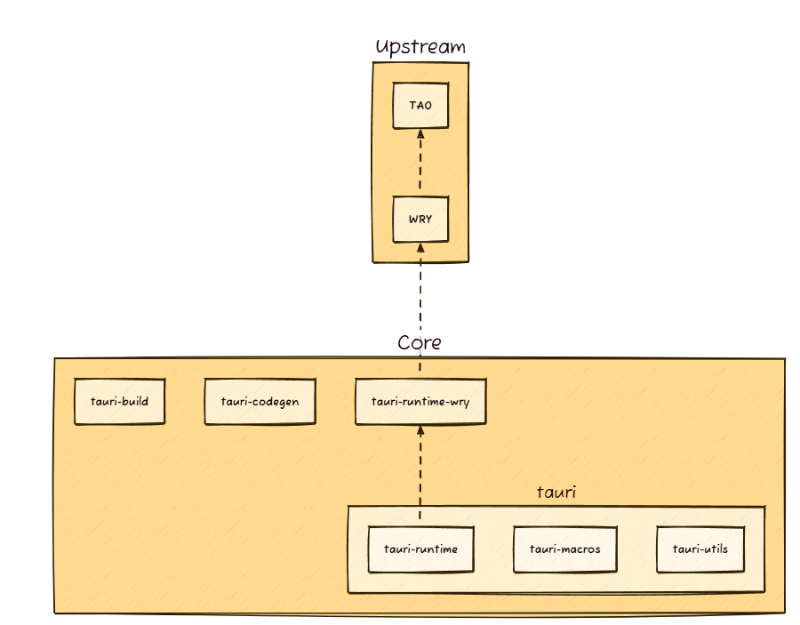

# What is it?

[Tauri](https://v2.tauri.app/start/)の勉強用プロジェクト


作ったときのログ

```text
✔ Project name · tauri-app
✔ Identifier · com.tauri-app.app
✔ Choose which language to use for your frontend · Rust - (cargo)
✔ Choose your UI template · Leptos - (https://leptos.dev/)

Template created!

Your system is missing dependencies (or they do not exist in $PATH):
╭───────────┬───────────────────────────────────────────────────────────╮
│ Tauri CLI │ Run `cargo install tauri-cli --version '^2.0.0' --locked` │
├───────────┼───────────────────────────────────────────────────────────┤
│ Trunk     │ Run `cargo install trunk --locked`                        │
╰───────────┴───────────────────────────────────────────────────────────╯

Make sure you have installed the prerequisites for your OS: https://tauri.app/start/prerequisites/, then run:
  cd tauri-app
  cargo tauri android init

For Desktop development, run:
  cargo tauri dev

For Android development, run:
  cargo tauri android dev
```

# [公式 2.0 Guide](https://v2.tauri.app/ja/start/)の読み込み

Tauriの利点

+ ビルドの安全な基盤
+ ネイティブWebViewを使った軽量アプリの構築
+ 複数言語の対応

invokeを利用してJs, Swift, Kotlinと連携できる(要Tauri-plugin)

+ [TAO](https://github.com/tauri-apps/tao): ウィンドウ管理
+ [WRY](https://github.com/tauri-apps/wry): Viewレンダリング

他にも[いろんなプラグイン](https://v2.tauri.app/plugin/)を提供している
いい感じのテンプレートが[Awsome Tauri](https://github.com/tauri-apps/awesome-tauri#guides)にまとまってる。


## [Create a Project](https://v2.tauri.app/ja/start/create-project/)

`cargo create-tauri-app`コマンドでプロンプトからテンプレートを指定してプロジェクトを作成できる。

テンプレート

+ vanilla 
+ Vue.js
+ Svelte
+ React
+ SolidJS
+ Angular
+ Preact
+ Yew
+ Leptos
+ Sycamore

## Frontend Configuration

### JavaScript

+ [Next.js](https://nextjs.org/): React Web Framework
+ [Nuxt](https://nuxt.com/): Vue framwwork
+ [Qwik](https://qwik.dev/): 大規模配信向けフレームワーク
+ [SvelteKit](https://svelte.dev/): Svelte向けFramework
+ Vite: 高速ビルドツール

### Rust

+ [Leptos](https://leptos.dev/): RustベースのWebフレームワーク
+ [Trunk](https://trunkrs.dev/): WASM Webバンドラ

## Core Concept

### [Tauri Archtecture](https://v2.tauri.app/concept/architecture/)

+ tray-type interface

tauri runtime(tauri) -> tauri-runtime-wry(core) -> wry -> tao



Eco System

| parts | description |
| :---- | :----- |
| tauri | tauri.config.jsonに従い、アプリを取りまとめる |
| tauri-runtime | tauriとWebViewの間を繋ぐ |
| tauri-macros | tauri-codegenを利用して各種マクロを提供する |
| tauri-utils | ユーティリティ |
| tarui-build | cargoコマンドに必要な機能を提供する |
| tauri-codegen | アプリ資源の圧縮及びConfig(tauri.config.json)を提供する |
| tauri-runtime-wry | wryに特化したコマンドを提供する |

Tooling

| parts | description |
| :----- |  :------ |
| API (JavaScript / TypeScript) | WebViewホストへのパッシング |
| Bundler (Rust / Shell) | 各プラットフォーム向けのアプリを構築する |
| cli.rs (Rust) | アクティビティへのIFを提供する |
| cli.js (JavaScript) | cli.rsのラップ。npmパッケージを構築する。 |
| create-tauri-app (JavaScript) | 新規プロジェクト作成支援 |

Upstream Crates

| parts | description |
| :----- |  :------ |
| TAO | ウィンドウ構築 |
| WRY | WebViewレンダリング |

Additional Tooling


| parts | description |
| :----- |  :------ |
| tauri-action  | 各プラットフォーム向けバイナリを作るgithub-actions |
| tauri-vscode | VSCode向けの機能 |
| vue-cli-plugin-tauri | vue-cli向けの機能 |

### Inter-Process Communication

### Security

### Process Model

### App Size

# Tauri + Leptos

This template should help get you started developing with Tauri and Leptos.

## Recommended IDE Setup

[VS Code](https://code.visualstudio.com/) + [Tauri](https://marketplace.visualstudio.com/items?itemName=tauri-apps.tauri-vscode) + [rust-analyzer](https://marketplace.visualstudio.com/items?itemName=rust-lang.rust-analyzer).


## コード解析

| directory | description |
| :----- | :----- |
| public | |
| src | |
| src-tauri | |
| index.html | |

# problem

## Permission fs:allow-write-text-file not found

[公式のpermission](https://v2.tauri.app/learn/security/using-plugin-permissions/)を学習中に発生

```text
 Permission fs:allow-write-text-file not found, expected one of core:default, core:app:default, core:app:allow-app-hide, core:app:allow-app-show, ...
warning: build failed, waiting for other jobs to finish...
```

[FileSystemのpermission](https://v2.tauri.app/plugin/file-system/#default-permission)

下記コマンド打ってなかった([公式](https://v2.tauri.app/learn/security/using-plugin-permissions/)に記載がない？)

```shell
cargo tauri add fs
```

# reference

+ [公式 2.0 Guide](https://v2.tauri.app/ja/start/)
+ [【JavaScript】ここがしんどかったよTauri開発【Rust】](https://qiita.com/kurokky/items/79017c7a867a6e8122f8)
+ [TauriとLeptosで作るデスクトップアプリ（1）プロジェクトを作成する](https://zenn.dev/daizutabi/articles/tauri-leptos-01)
+ [Leptosを使ってTauriアプリのフロントエンドもRustで書く](https://zenn.dev/laiso/articles/ab8db73d66623a)