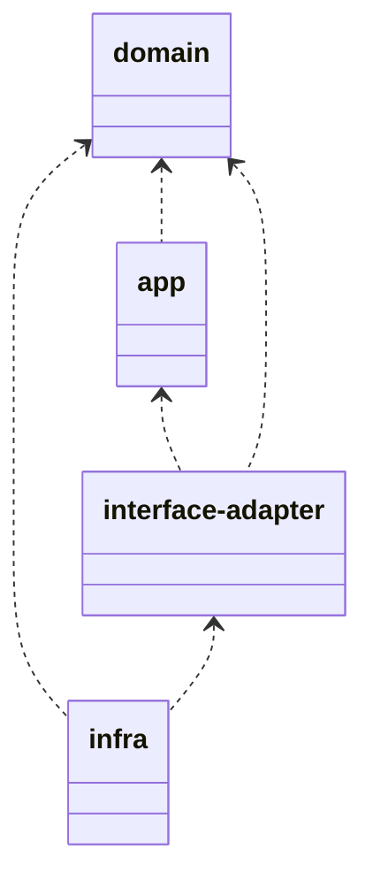

# outline

Multi-packageなプロジェクト

layers

| layer | description |
| :---- | :---- |
| app | usecase |
| domain | repository |
| interface-adapter | controller |
| infra | main |

# reference

+ 俺とお前とlaysakura
  + [Rustでmockするならmockallで決まり！・・・でよろしいでしょうか？](https://laysakura.github.io/2021/04/25/rust-mockall/)
+ [mockall-example-rs](https://github.com/laysakura/mockall-example-rs)
+ [Cargo Workspaces](https://doc.rust-lang.org/book/ch14-03-cargo-workspaces.html)