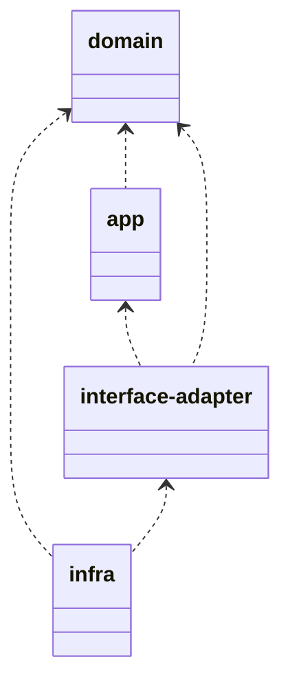
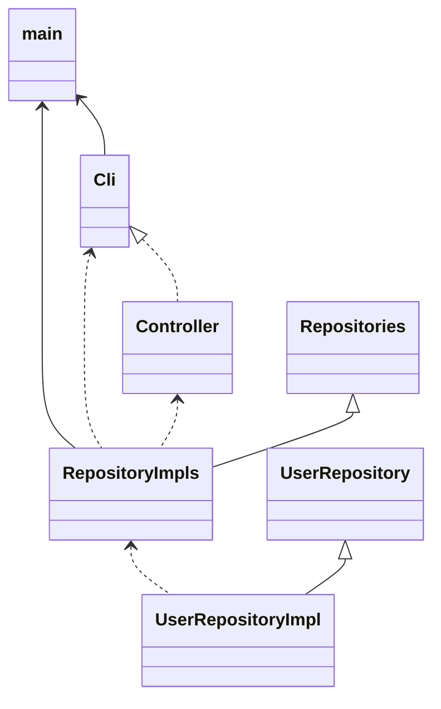

# outline

Multi-packageなプロジェクト

layers

| layer | description |
| :---- | :---- |
| app | usecase |
| domain | repository, mockall利用 |
| interface-adapter | controller |
| infra | main |

infra

infra

| name | type |has | impl | description |
| :---- | :----: | :---- | :---- | :---- |
| Cli | struct | Controller<RepositoryImpls> | | DTO(request)の作成及びcontrollerへの引き渡し |
| RepositoryImpls | struct| UserRepositoryImpl | Repositories | Repositoriesの実装 |
| UserRepositoryImpl | struct | |UserRepository , Default | UserRepositoryの実装 |

interface-adadpter

| name | type |has | impl | description |
| :---- | :----: | :---- | :---- | :---- |
| Controller | struct | UseCase<Repositories> | | |
| SearchUsersRequestDTO | struct | | | |
| SearchUsersResponseDTO | struct | | | |
| AddUserRequestDTO | struct  | | | |
| AddUserResponseDTO | struct  | | | |
| UpdateUserRequestDTO | struct  | | | |
| UpdateUserResponseDTO | struct  | | | |

app

| name | type |has | impl | description |
| :---- | :----: | :---- | :---- | :---- |
| UseCase | struct | UserRepo | Repositories | |

domain

| name | type |has | impl | description |
| :---- | :----: | :---- | :---- | :---- |
| Repositories | trait  | | | UserRepositoryの提供。(UserRepo: UserRepository) |
| User | struct  | | | |
| UserRepository | trait | | | |
| MyError | struct  | | Error, Display | |
| EmailAddress | struct | | Display | |
| MyErrorType | enum | | | |
| UserId | struct | | | |
| UserName | struct | | Display | |
| UserFirstName | struct | | | |
| UserLastName | struct | | | |

# reference

+ 俺とお前とlaysakura
  + [Rustでmockするならmockallで決まり！・・・でよろしいでしょうか？](https://laysakura.github.io/2021/04/25/rust-mockall/)
+ [mockall-example-rs](https://github.com/laysakura/mockall-example-rs)
+ [Cargo Workspaces](https://doc.rust-lang.org/book/ch14-03-cargo-workspaces.html)