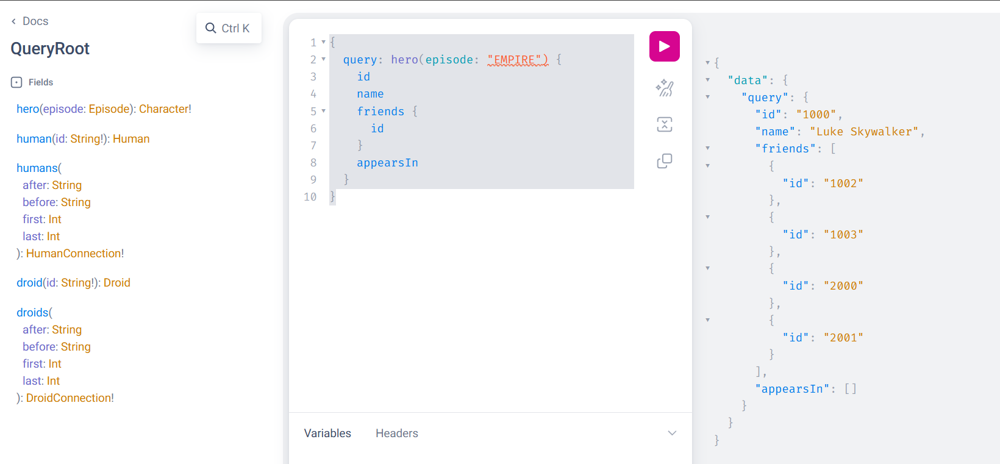

# outline

[web_app_todo_graphql](https://github.com/miyatama/learn_rust/tree/main/projects/web_app_todo_graphql)のクライアント

# memo

schema取得([graphql_client_cli](https://github.com/graphql-rust/graphql-client/tree/main/graphql_client_cli))

```shell
cargo install graphql_client_cli
graphql-client introspect-schema http://localhost:3000 --output ./src/schema.json
```

リポジトリは自分はderiveで自動作成してもらう or 下記コマンドでコードを生成する

```shell
graphql-client generate ./src/query.graphql --output-directory ./src --schema-path ./src/schema.json
graphql-client generate ./src/mutation_add_todo.graphql --output-directory ./src --schema-path ./src/schema.json
graphql-client generate ./src/mutation_delete_todo.graphql --output-directory ./src --schema-path ./src/schema.json
graphql-client generate ./src/subscription.graphql --output-directory ./src --schema-path ./src/schema.json
```

__schemaの情報取得(query)

```json
{
  __schema {
    description
    queryType {
      name
      description
      specifiedByURL
      isOneOf
    }
    mutationType {
      name
      description
      specifiedByURL
      isOneOf
    }
    subscriptionType {
      name
      description
      specifiedByURL
      isOneOf
    }
    types {
      name
      description
      specifiedByURL
      isOneOf
    }
    directives {
      description
    }
  }
}
```

# query

http://localhost:3000で投げられるquery

## hero(by StarWars)



```json
{
  query: hero(episode: "EMPIRE") {
    id
    name
    friends {
      id
    }
    appearsIn
  }
}
```

# errors

## cargo install graphql_clientでエラー

```text
error: there is nothing to install in `graphql_client v0.14.0`, because it has no binaries
`cargo install` is only for installing programs, and can't be used with libraries.
To use a library crate, add it as a dependency to a Cargo project with `cargo add`.
```

cliは下記でインストール

```shell
cargo install graphql_client_cli
```

## error[E0277]: the trait bound `WebSocketStream<async_std::net::TcpStream>: Connection` is not satisfied

[example](https://github.com/obmarg/graphql-ws-client/blob/main/examples/examples/graphql-client-single-subscription.rs)を参考に組み込んだら発生。

```text
error[E0277]: the trait bound `WebSocketStream<async_std::net::TcpStream>: Connection` is not satisfied
  --> src\main.rs:49:55
   |
49 |     let mut stream = graphql_ws_client::Client::build(connection)
   |                      -------------------------------- ^^^^^^^^^^ the trait `Connection` is not implemented for `WebSocketStream<async_std::net::TcpStream>`
   |                      |
   |                      required by a bound introduced by this call
   |
   = help: the trait `Connection` is implemented for `Conn`
note: required by a bound in `graphql_ws_client::next::builder::<impl graphql_ws_client::Client>::build`
  --> .cargo\registry\src\index.crates.io-6f17d22bba15001f\graphql-ws-client-0.11.1\src\next\builder.rs:56:15
   |
54 |     pub fn build<Conn>(connection: Conn) -> ClientBuilder
   |            ----- required by a bound in this associated function
55 |     where
56 |         Conn: Connection + Send + 'static,
   |               ^^^^^^^^^^ required by this bound in `graphql_ws_client::next::builder::<impl Client>::build`

```

[公式](https://docs.rs/async-tungstenite/0.28.2/async_tungstenite/)より

```text
async-std-runtime: Enables the async_std module, which provides integration with the async-std runtime.
```

```text
the trait `Connection` is not implemented for `WebSocketStream<async_std::net::TcpStream>`
```

[graphql-ws-client::Client::build()](https://docs.rs/graphql-ws-client/latest/graphql_ws_client/struct.Client.html#method.build)より

```text
pub fn build<Conn>(connection: Conn) -> ClientBuilder
where
    Conn: Connection + Send + 'static,
```

なので、connectionは`Connection + Send + 'static`である必要がある。connectionは

```rust
use async_tungstenite::{
    async_std::connect_async,
};
let (connection, response) = connect_async(request).await.unwrap();
```

[async_tungstenite::async_std::connect_async()](https://docs.rs/async-tungstenite/0.28.2/async_tungstenite/async_std/fn.connect_async.html)

```rust
pub async fn connect_async<R>(
    request: R,
) -> Result<(WebSocketStream<ConnectStream>, Response), Error>
where
    R: IntoClientRequest + Unpin,
```

組み込み的には、connection = `WebSocketStream<ConnectStream>`。
なので、`WebSocketStream<ConnectStream>` != `Connection + Send + 'static` じゃないっぽい。

[Connection](https://docs.rs/graphql-ws-client/latest/graphql_ws_client/trait.Connection.html)

よくわからんが、graphql-ws-clientの"tungstenite"featureを有効にしたら治った。謎。

### 対象のコンピュータが見つからない

```text
thread 'main' panicked at src\main.rs:50:63:
called `Result::unwrap()` on an `Err` value: Io(Os { code: 10061, kind: ConnectionRefused, message: "対象のコンピューターによって拒否されたため、接続できま せんでした。" })
```

サーバ側のwsを設定する必要があるか調査 -> 必要ある

axumのルート作成時にsubscriptionの口を作る

```rust
let schema = async_graphql::Schema::build(QueryRoot, MutationRoot, SubscriptionRoot)
    .data(Storage::default())
    .finish();
let app = Router::new()
    .route("/", get(graphiql).post_service(GraphQL::new(schema.clone())))
    .route_service("/ws", GraphQLSubscription::new(schema));
let listener = tokio::net::TcpListener::bind("0.0.0.0:3000").await.unwrap();
axum::serve(listener, app).await.unwrap();
```

# reference

+ [GraphQLのクエリを基礎から整理してみた](https://qiita.com/shunp/items/d85fc47b33e1b3a88167)
+ [RustでGitHub GraphQL APIを使ってissue一覧を取得する](https://blog.ymgyt.io/entry/fetch-issues-using-github-graphql-api-in-rust/)
+ [GraphQL の Introspection について - schema.json って何だろう](https://lightbulbcat.hatenablog.com/entry/2018/02/17/174623)
+ [ゼロからGraphQLを学ぶ](https://zenn.dev/kengoku123/articles/graphql-from-scratch)
+ github
  + [graphql_client - example](https://github.com/graphql-rust/graphql-client/tree/main/examples)
  + [graphql_ws_client - example](https://github.com/obmarg/graphql-ws-client/tree/main/examples/examples)
+ crate.io
  + [graphql_client](https://crates.io/crates/graphql_client)
  + [async-tungstenite](https://crates.io/crates/async-tungstenite)
  + [async-std](https://crates.io/crates/async-std)